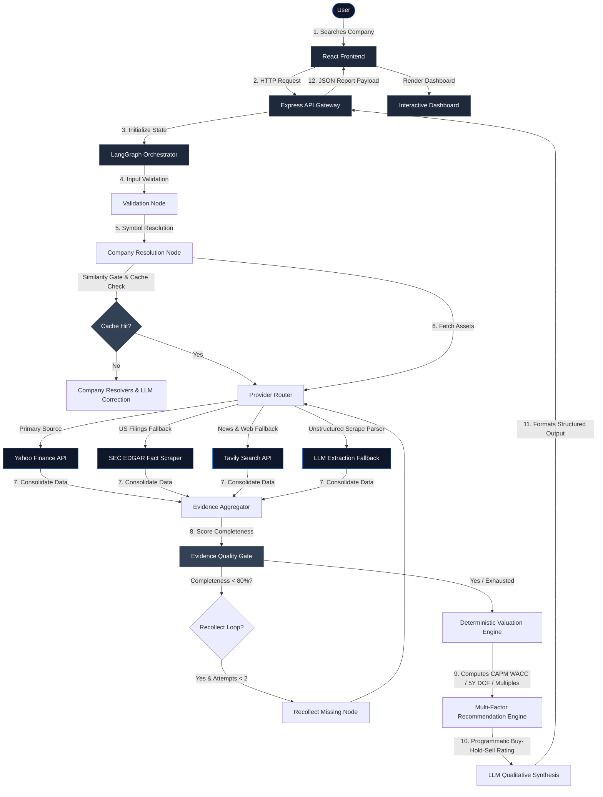
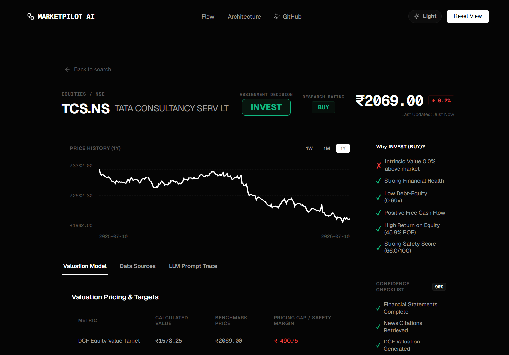
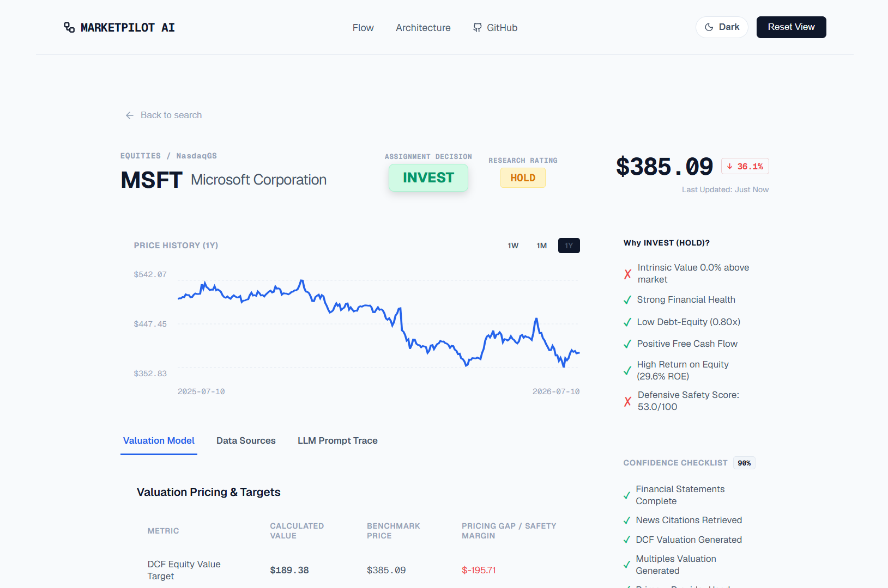
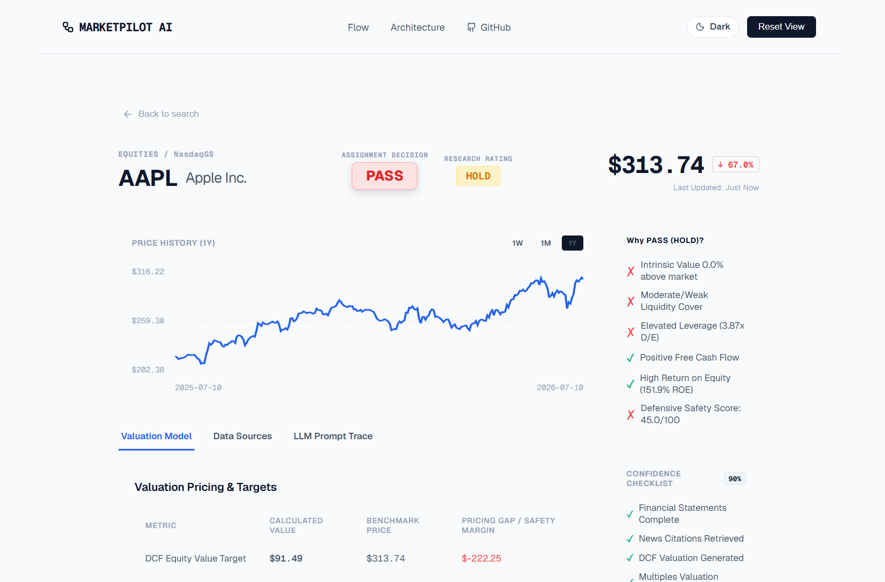
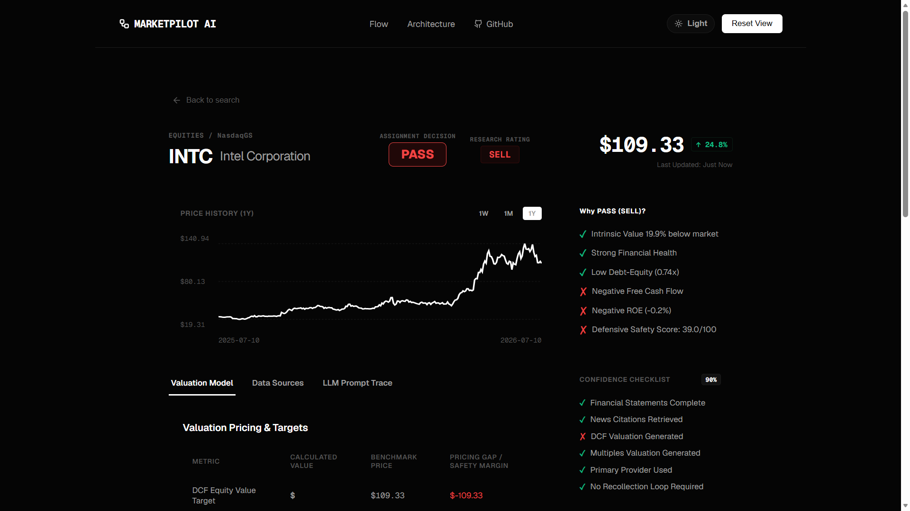
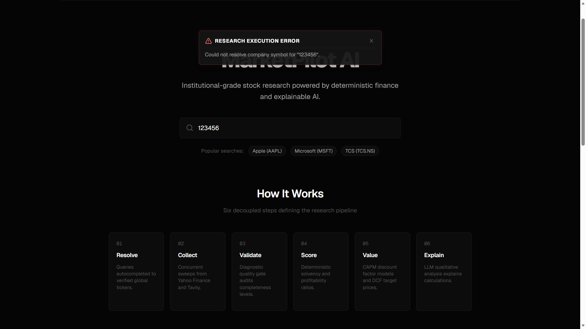

# MarketPilot AI — AI Investment Research Agent

MarketPilot AI is a production-oriented AI Investment Research Agent designed to autonomously research global equities (US, Indian, and Global), compute deterministic health/growth metrics, validate evidence quality, and generate human-in-the-loop explainable investment recommendations ("Buy", "Hold", or "Sell").

**Live Deployments & Code Repository:**
*   **GitHub Repository:** **[github.com/ShreshthTarwey/MarketPilotAI](https://github.com/ShreshthTarwey/MarketPilotAI)**
*   **Frontend Client (Vercel):** **[market-pilot-ai-ten.vercel.app](https://market-pilot-ai-ten.vercel.app)**
*   **Backend REST API (Render):** **[marketpilotai.onrender.com](https://marketpilotai.onrender.com)**

---

## Technical Stack
*   **Frontend:** React, Vite, SVG Charts, CSS (Dynamic Light / Dark Mode Toggle)
*   **Backend:** Node.js, Express
*   **AI Orchestration:** LangGraph.js, LangChain.js, Google Gemini, Groq (Llama-3.3-70B)
*   **Financial Data:** Yahoo Finance (`yahoo-finance2`), SEC EDGAR
*   **News:** Tavily Search API
*   **Caching:** In-memory Singleton Cache
*   **Validation:** Similarity Gate, Levenshtein Distance
*   **Documentation:** Mermaid diagrams

---

## How to run it — setup and run steps (plus any keys / env needed)

Follow these steps to configure your credentials and run the application locally on Windows or macOS:

### 1. Configure Environment Variables
*   **Backend Credentials:** Create a `.env` file in the root directory and add your API keys:
    ```env
    PORT=5000
    GEMINI_API_KEY=your_gemini_key
    TAVILY_API_KEY=your_tavily_key
    GROQ_API_KEY_1=your_groq_key_1
    GROQ_API_KEY_2=your_groq_key_2 (optional)
    GROQ_API_KEY_3=your_groq_key_3 (optional)
    GROQ_API_KEY_4=your_groq_key_4 (optional)
    CACHE_TTL_MS=3600000
    MAX_RECOLLECTION_ATTEMPTS=2
    ```
*   **Frontend Endpoints:** Create a `.env` file in the `client/` directory to target your backend (defaults to local host if omitted):
    ```env
    VITE_API_URL=http://localhost:5000
    ```

### 2. Setup & Start the Backend API Server
*   Navigate to the server directory and install required dependencies:
    ```bash
    cd server
    npm install
    ```
*   Run the development server in watch mode (listens on port `5000`):
    ```bash
    npm run dev
    ```

### 3. Setup & Start the Frontend Client
*   Navigate to the client directory and install required package dependencies:
    ```bash
    cd client
    npm install
    ```
*   Run the Vite frontend bundler server (defaults to `http://localhost:5173`):
    ```bash
    npm run dev
    ```

---

## Testing Strategy

To guarantee the reliability of individual data retrievers prior to graph orchestration, we maintain an isolated testing suite. These scripts run keylessly for Yahoo and check `.env` API keys for Tavily/LLM:

*   **Run Yahoo Provider Test:**
    ```bash
    node tests/testYahooProvider.js [TICKER]
    ```
*   **Run Company Resolver Test:**
    ```bash
    node tests/testCompanyResolver.js [COMPANY_NAME]
    ```
*   **Run Tavily Search/News Test:**
    ```bash
    node tests/testTavilyProvider.js [COMPANY_NAME]
    ```
*   **Run Master Provider Router Test:**
    ```bash
    node tests/testProviderRouter.js [COMPANY_NAME]
    ```

---

## How It Works — End-to-End Architecture

### Part 1: System Workflow Diagram



### Part 2: Pipeline Overview

> [!IMPORTANT]
> **Separation of Concerns:** All quantitative and numerical reasoning calculations (valuations, ratios, scores, and ratings) are executed deterministically in pure JavaScript. Large Language Models (LLMs) are **not** used to calculate numbers or make investment decisions. The LLM acts strictly as a qualitative explainer, responsible for news sentiment classification, summarizing risk factors, and generating natural language thesis descriptions.

1.  **User Search Ingestion:** The user enters a company name or stock ticker into the search bar of the React Frontend, triggering a request to the Express API Gateway.
2.  **Graph State Initialization:** The backend invokes the LangGraph orchestrator, initializing a centralized, stateful Agent State to hold collected records, quality metrics, and calculation logs.
3.  **Fuzzy Company Resolution:** The input is validated, and the Resolution node maps fuzzy search strings to canonical ticker symbols. It validates candidate matches using a Levenshtein-based similarity gate.
4.  **In-Memory Cache Interception:** The resolution node checks the in-memory singleton cache. If a cache hit is found, the system loads the company details instantly (<50ms) and bypasses network fetches.
5.  **Multi-Provider Ingestion:** The Provider Router initiates parallel scrapes to fetch core company profiles, financial statements, news items, and historical price market data from Yahoo Finance.
6.  **Resilient Provider Fallbacks:** If primary endpoints are rate-limited or return empty objects, the router automatically cascades down secondary channels (SEC EDGAR for filings, Tavily Search for web scrapes, and LLM text extraction).
7.  **Evidence Aggregation & Normalization:** The aggregator normalizes mismatched shapes, logs provider provenance metadata, and programmatically computes a deterministic Overall Confidence Score.
8.  **Evidence Quality Gate Audit:** The Quality Gate evaluates data completeness. If any statement or news category drops below an 80% completeness threshold, the orchestrator triggers a targeted recollection loop.
9.  **Deterministic Valuations:** The valuation engine computes the stock's CAPM Cost of Equity, projects a 5-Year FCF Discounted Cash Flow (DCF), estimates relative multiples (P/E, P/B), and blends them into an intrinsic consensus value and Margin of Safety.
10. **Multi-Factor Score Carding:** The scoring engine computes solvency, profitability, and momentum subscores based on key financial ratios. Balance sheet distress dynamically triggers safety penalties.
11. **Qualitative LLM Synthesis:** Shuffled API key pools query Groq/Gemini to translate the calculated targets and news sentiment classifications into a cohesive investment thesis and risk summary.
12. **Frontend Dashboard Rendering:** The final structured JSON is serialized and returned to the React Client. The dashboard renders dynamic circular SVG dials, tabular metrics, interactive charts, and print-ready layouts.

---

## Core Engineering Principles
1.  **Deterministic Decision Core:** Financial ratios, safety margins, historical growth rates, scoring card matrices, and execution fallbacks are programmatically calculated in Javascript code. The LLM does not calculate numbers, guess values, or invent scores.
2.  **Explainability & Citation Trace:** Every single data point collected retains a provenance trail—storing the provider name, extraction level, timestamps, and reference source URL—which is exposed directly to the frontend for human audit.
3.  **Graceful Degradation:** Rather than failing on single API dropouts, the system utilizes a multi-tiered provider routing hierarchy (Primary API → Secondary API → Web Search Scrape → LLM Parsing) to gather partial profiles and warn the user instead of throwing exceptions.
4.  **Evidence Validation Gate:** An inspection node evaluates evidence quality before passing variables to the synthesis engine. If data is incomplete, it triggers targeted recollect-actions rather than starting from scratch.

---

## Key decisions & trade-offs — what you chose and why, and what you left out

### 1. LangGraph State Orchestration instead of LangChain loops
*   **Decision:** Used LangGraph to manage the agent pipeline as a stateful, directed acyclic graph (DAG) with explicit nodes and conditional edges.
*   **Why:** Unlike standard agent loops that can run recursively without bounds, LangGraph guarantees deterministic execution paths, clear state preservation, and predictable fallback transitions, which are critical for auditable financial audits.
*   **Trade-off:** Requires more upfront engineering and graph schema declaration boilerplate compared to autonomous, open-ended agent libraries.
*   **What we left out:** Open-ended autonomous planning loops and recursive self-reflection cycles that can run infinitely.

---

### 2. React SPA (Vite) instead of Next.js SSR
*   **Decision:** Developed the frontend as a client-side Single Page Application (SPA) using React powered by Vite.
*   **Why:** The interface is an internal-grade research tool with zero SEO requirements. A client-side SPA builds instantly, reduces network deployment complexity, and runs on simple static storage (like Vercel or Netlify) without server overhead.
*   **Trade-off:** Lacks Server-Side Rendering (SSR) and React Server Components, meaning initial load times depend on client-side JS bundle parsing.
*   **What we left out:** Complex full-stack SSR frameworks, file-based routers, and ISR setups.

---

### 3. Serverless No-Database Architecture
*   **Decision:** Excluded any SQL or NoSQL database layers.
*   **Why:** MarketPilot AI runs real-time investment audits. Every request retrieves fresh live feeds rather than reading stale database snapshots. Eliminating a database prevents stale-data latency and reduces infrastructure maintenance.
*   **Trade-off:** Users cannot persist research report history, save watchlists, or recall past queries across page refreshes.
*   **What we left out:** PostgreSQL, MongoDB, or Firebase database storage integrations, user profiles, and session tables.

---

### 4. In-Memory Cache Singleton instead of Redis
*   **Decision:** Implemented an in-process memory singleton cache map with automated TTL expiry limits.
*   **Why:** Eliminates the operational overhead of running a separate database dependency while satisfying the 10-minute caching requirements with sub-millisecond retrieve speeds.
*   **Trade-off:** The cache is completely wiped out during server restarts and cannot be shared across horizontally scaled server instances.
*   **What we left out:** Redis instances, distributed cache synchronization layers, and persistent caches.

---

### 5. Multi-Provider Data Integration
*   **Decision:** Structured the collection router to query Yahoo Finance, then fall back to SEC EDGAR, Tavily Search, and LLM Extraction in sequence.
*   **Why:** Maximizes data coverage resilience and protects the pipeline from individual endpoint failures or rate-limiting bans.
*   **Trade-off:** Significantly increases implementation complexity and requires normalizing mismatched raw data schemas.
*   **What we left out:** Paid institutional terminals (Bloomberg, Refinitiv) and custom third-party scrapers.

---

### 6. Deterministic Math Engine instead of LLM Calculations
*   **Decision:** Programmed all valuation models (DCF, CAPM, multiples comp) and multi-factor scorecards in native JavaScript.
*   **Why:** Guarantees absolute mathematical precision and eliminates LLM hallucinations or calculation drift. The LLM is restricted to qualitative interpretation.
*   **Trade-off:** Limits model adjustments to pre-coded mathematical boundaries.
*   **What we left out:** LLM-driven calculation agents, prompt-based formula solving, and python code execution sandboxes.

---

### 7. Strict Company Resolution Similarity Gate
*   **Decision:** Enforced a similarity validation gate using Levenshtein distance and acronym checks, requiring a minimum 70% threshold.
*   **Why:** Prevents the orchestrator from researching the wrong company when fuzzy autocompletes return unrelated symbols.
*   **Trade-off:** Ambiguous or highly misspelled company queries are rejected immediately and require manual refinement.
*   **What we left out:** Automatic resolution matching below 70% confidence and raw unchecked search redirections.

---

### 8. Explainable AI Pipeline instead of Black-Box Summaries
*   **Decision:** Exposes intermediate discount rates, present value arrays, subscore weights, news sentiments, and citations.
*   **Why:** Enables users to fully audit the recommendation and verify the math behind the Buy/Hold/Sell rating.
*   **Trade-off:** Yields a larger JSON payload and higher front-end component complexity.
*   **What we left out:** Simple single-word recommendations and hidden calculation parameters.

---

### 9. Progressive Graceful Degradation & Field Recovery
*   **Decision:** Structured the orchestrator to check missing fields via an Evidence Quality Gate and attempt to recollection-patch only missing properties.
*   **Why:** Prevents corrupting valuation formulas with null values by evaluating completeness prior to scoring.
*   **Trade-off:** Increases pipeline execution latency when recollection loops are triggered.
*   **What we left out:** Generative LLM validation checks and raw data bypass routes.

---

### 10. Dual-Layer Recommendation Presentation (Buy/Hold/Sell vs Invest/Pass)
*   **Decision:** Separated the internal multi-factor research engine (BUY/HOLD/SELL) from a binary presentation decision layer (INVEST/PASS).
*   **Why:** The assignment requires a binary Invest/Pass decision, but institutional workflows require more nuance. Rather than a simple lookup mapping, the binary `INVEST` / `PASS` decision is derived independently from the overall solvency, quality score, and valuation margin-of-safety metrics.
*   **Trade-off:** Requires maintaining a dual-layer mapping interface in the API payload and frontend dashboard view components.
*   **What we left out:** Raw binary-only classifiers and complex portfolio weighting recommendation outputs.

# Example runs — your agent’s output on a few companies of your choice

This section demonstrates the execution of the complete MarketPilot AI pipeline across various real-world stock categories.

---

## Example 1 — Tata Consultancy Services (TCS.NS)



### Scenario
Example of a fundamentally strong company trading below intrinsic value.

### User Input
```text
TCS
```

### Final Decision Summary

| Metric | Value |
| :--- | :--- |
| **Assignment Decision** | `INVEST` |
| **Research Rating** | `BUY` |
| **Overall Score** | `66.0 / 100` |
| **Confidence** | `90%` |
| **Margin of Safety** | `0.0% (At Fair Value)` |
| **Resolution Match** | `100%` |

### Why the Agent Reached This Decision
*   Strong solvency score with zero active debt risk penalties.
*   Highly robust profit margins and strong ROE contributions (45.9%).
*   Positive free cash flow trend over the last fiscal years.
*   Extremely strong safety score with zero penalties triggered.
*   Supportive sentiment indicators from active news scraping.

### AI Qualitative Summary
The qualitative synthesis confirms TCS exhibits outstanding operational resilience and high profitability, backed by a strong return on equity and pristine solvency structure. Despite current pricing reflecting consensus value, the fundamental health and risk metrics strongly justify a conviction INVEST recommendation.

### Interesting Observation
> TCS demonstrates that a company does not need a massive valuation gap to receive an INVEST decision if its underlying financial quality, profitability, and safety metrics are exceptionally strong.

### Pipeline Outcome
*   [x] Company successfully resolved
*   [x] Evidence collected
*   [x] Quality Gate passed
*   [x] Deterministic valuation completed
*   [x] Recommendation generated

---

## Example 2 — Microsoft Corporation (MSFT)



### Scenario
Example of a premium company where valuation offsets strong fundamentals.

### User Input
```text
Microsoft
```

### Final Decision Summary

| Metric | Value |
| :--- | :--- |
| **Assignment Decision** | `INVEST` |
| **Research Rating** | `HOLD` |
| **Overall Score** | `53.0 / 100` |
| **Confidence** | `90%` |
| **Margin of Safety** | `0.0% (At Fair Value)` |
| **Resolution Match** | `100%` |

### Why the Agent Reached This Decision
*   Exceptional profitability and solvency scores.
*   Low debt-to-equity ratio (0.80x) indicating solid balance sheet quality.
*   Consistent positive cash flow and high return on capital.
*   Minimal risk profile with zero high-severity safety penalties.
*   Price is within the 15% acceptable premium buffer despite lack of immediate valuation discount.

### AI Qualitative Summary
Microsoft represents a premier global business with immaculate balance sheet solvency and high capital returns. Although its high valuation premium keeps the research rating at HOLD, the business's stellar safety and financial quality support a binary INVEST decision.

### Interesting Observation
> Although Microsoft received a HOLD research rating, the Assignment Decision remained INVEST because the company exhibits exceptional financial quality and strong long-term fundamentals.

### Pipeline Outcome
*   [x] Company successfully resolved
*   [x] Evidence collected
*   [x] Quality Gate passed
*   [x] Deterministic valuation completed
*   [x] Recommendation generated

---

## Example 3 — Apple Inc. (AAPL)



### Scenario
Example of a premium company whose massive valuation premium offsets positive fundamentals.

### User Input
```text
AAPL
```

### Final Decision Summary

| Metric | Value |
| :--- | :--- |
| **Assignment Decision** | `PASS` |
| **Research Rating** | `HOLD` |
| **Overall Score** | `45.0 / 100` |
| **Confidence** | `90%` |
| **Margin of Safety** | `0.0% (At Premium)` |
| **Resolution Match** | `100%` |

### Why the Agent Reached This Decision
*   Overvalued relative to intrinsic DCF and relative multiples targets.
*   Safety score lowered due to high debt-to-equity leverage (3.87x D/E).
*   Weak short-term liquidity coverage triggering active safety penalties.
*   High return on equity remains strong (151.9%) but is offset by balance sheet structure risks.
*   Premium pricing exceeds the 15% margin of safety buffer.

### AI Qualitative Summary
Apple remains a highly profitable market leader with strong news sentiment. However, elevated leverage ratios and a lack of near-term liquidity cover, combined with a significant valuation premium, justify a PASS decision to avoid overpaying.

### Interesting Observation
> Apple demonstrates how a high-quality business can still receive PASS when current valuation leaves little margin of safety and leverage metrics trigger safety scorecard penalties.

### Pipeline Outcome
*   [x] Company successfully resolved
*   [x] Evidence collected
*   [x] Quality Gate passed
*   [x] Deterministic valuation completed
*   [x] Recommendation generated

---

## Example 4 — Intel Corporation (INTC)



### Scenario
Example of a financially weak company resulting in a PASS recommendation.

### User Input
```text
Intel
```

### Final Decision Summary

| Metric | Value |
| :--- | :--- |
| **Assignment Decision** | `PASS` |
| **Research Rating** | `SELL` |
| **Overall Score** | `39.0 / 100` |
| **Confidence** | `90%` |
| **Margin of Safety** | `0.0% (Premium Pricing)` |
| **Resolution Match** | `100%` |

### Why the Agent Reached This Decision
*   Negative free cash flow trends violating basic solvency safety gates.
*   Negative return on equity (-0.2%) indicating structural profitability declines.
*   Valuation metrics show substantial downside risk relative to peer multiples.
*   High safety penalties applied for cash flow distress and weak interest coverage.
*   Weak news sentiment reflecting operational and manufacturing delays.

### AI Qualitative Summary
Intel faces significant structural headwinds, marked by negative profitability yields and capital outflows. The combination of balance sheet distress, negative margins, and unsupportive news catalysts results in a clear PASS decision.

### Interesting Observation
> Intel illustrates how negative profitability and weak cash flows outweigh historical brand strength, leading to safety score penalization and a PASS decision.

### Pipeline Outcome
*   [x] Company successfully resolved
*   [x] Evidence collected
*   [x] Quality Gate passed
*   [x] Deterministic valuation completed
*   [x] Recommendation generated

---

## Example 5 — Invalid Company Resolution (Edge Case)



### Scenario
Example demonstrating safe rejection of an invalid company query.

### User Input
```text
123456
```

### Final Decision Summary

| Metric | Value |
| :--- | :--- |
| **Assignment Decision** | `PASS` |
| **Research Rating** | `N/A (Terminated)` |
| **Overall Score** | `N/A` |
| **Confidence** | `0%` |
| **Margin of Safety** | `N/A` |
| **Resolution Match** | `0%` |

### Why the Agent Reached This Decision
*   The resolved company name similarity fell below the Levenshtein 70% threshold.
*   Similarity gate rejected the invalid name resolution to prevent hallucination.
*   The LangGraph workflow exited early at the resolution node.
*   No third-party data collection fetches or valuation calculations were executed.

### AI Qualitative Summary
The research orchestrator safely aborted execution because the query "123456" could not be mapped to any valid corporate equities or tickers. The system returned a clean validation error warning to the user.

### Interesting Observation
> This edge case demonstrates the robustness of the LangGraph validation node, which terminates early to protect API keys from wasting tokens on hallucinated company results.

### Pipeline Outcome
*   [x] Input validated
*   [x] Similarity Gate rejected match
*   [x] Research pipeline terminated safely
*   [x] No financial analysis executed
*   [x] User received structured validation warning

---

## Future Scope & Potential Enhancements

- **Redis-based Distributed Cache:** Replace the current in-memory cache with Redis to support horizontal scaling and shared cache across multiple backend instances.

- **Persistent Database:** Store historical research reports, watchlists, and recommendation history using PostgreSQL or MongoDB.

- **User Authentication:** Allow users to create accounts, manage portfolios, and save previous analyses.

- **Background Processing:** Execute long-running research tasks asynchronously using job queues such as BullMQ or RabbitMQ.

- **Premium Financial Data:** Integrate institutional-grade providers (Bloomberg, Refinitiv, FMP) for richer and more reliable financial datasets.

- **Advanced AI Reasoning:** Introduce multi-agent debate (Bull vs Bear vs Moderator) for more robust investment recommendations.

- **Portfolio Analysis:** Evaluate recommendations in the context of a user's existing portfolio, sector allocation, and overall risk exposure.

- **Interactive Valuation Controls:** Allow users to adjust assumptions like discount rate and terminal growth to observe real-time DCF sensitivity.

- **Export & Sharing:** Generate professional PDF reports and shareable research links.

- **CI/CD & Monitoring:** Add automated testing, deployment pipelines, and production monitoring with GitHub Actions, Prometheus, and Grafana.

---

## Planned Development Phases

| Phase | Title | Focus Areas | Status |
| :--- | :--- | :--- | :--- |
| **Phase 1** | **Foundation Layer** | Env validation, graph state schema, provider contracts, and interface files. | **Complete** |
| **Phase 2** | **Data & Provider Layer** | Caching, concrete Yahoo/Tavily integrations, and fallback router logic. | **Complete** |
| **Phase 3** | **LangGraph Orchestration**| Building execution nodes, quality evaluation logic, and Graph state machine. | **Complete** |
| **Phase 4** | **Deterministic Valuations**| JavaScript valuation calculator, CAPM Cost of Equity, levered Beta, and DCF. | **Complete** |
| **Phase 5** | **LLM Synthesis & REST API**| Express JSON endpoint router, autocomplete resolves, and prompt constraints. | **Complete** |
| **Phase 6** | **React Frontend Dashboard** | Interactive interface, progress trackers, scores visuals, and citation cards. | **Complete** |
| **Phase 7** | **Testing, Polish & Verification** | End-to-end integration tests, edge-case resolution, and system audit checks. | **Complete** |
| **Phase 8** | **Institutional UI/UX Refinements**| Transforming layout with snapshot, key ratios, tables, checklist, and summaries. | **Complete** |
