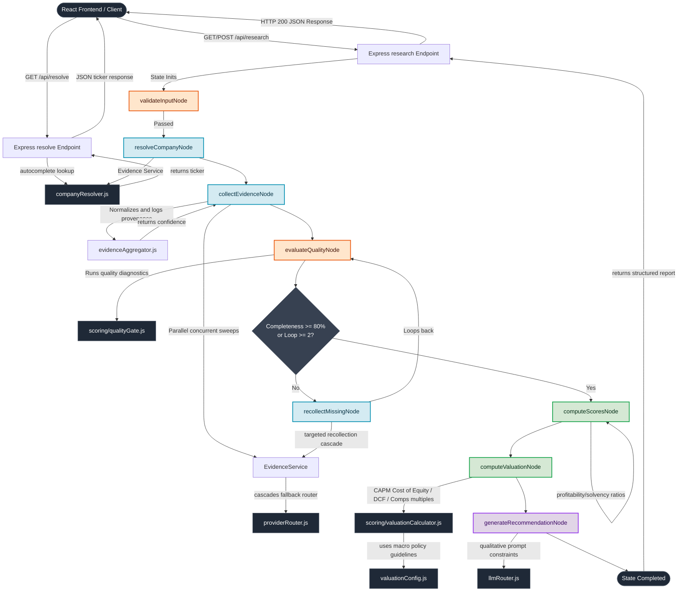

# MarketPilot AI — AI Investment Research Agent

MarketPilot AI is a production-oriented AI Investment Research Agent designed to autonomously research global equities (US, Indian, and Global), compute deterministic health/growth metrics, validate evidence quality, and generate human-in-the-loop explainable investment recommendations ("Invest" or "Pass").

---

## Technical Stack
*   **Frontend:** React (Vite) + Vanilla CSS (Dynamic Glassmorphic Design)
*   **Backend:** Node.js + Express
*   **Workflow Engine:** LangGraph.js (State-driven workflow orchestrator)
*   **LLM Provider:** Groq (Llama 3.3 70B) with Gemini API key rotation fallbacks
*   **Data Channels:** `yahoo-finance2` (Primary Financials/Metadata) + Tavily Search API (Fallback Scraping & News)

---

## Core Engineering Principles
1.  **Deterministic Decision Core:** Financial ratios, safety margins, historical growth rates, scoring card matrices, and execution fallbacks are programmatically calculated in Javascript code. The LLM does not calculate numbers, guess values, or invent scores.
2.  **Explainability & Citation Trace:** Every single data point collected retains a provenance trail—storing the provider name, extraction level, timestamps, and reference source URL—which is exposed directly to the frontend for human audit.
3.  **Graceful Degradation:** Rather than failing on single API dropouts, the system utilizes a multi-tiered provider routing hierarchy (Primary API → Secondary API → Web Search Scrape → LLM Parsing) to gather partial profiles and warn the user instead of throwing exceptions.
4.  **Evidence Validation Gate:** An inspection node evaluates evidence quality before passing variables to the synthesis engine. If data is incomplete, it triggers targeted recollect-actions rather than starting from scratch.

---

## Planned Development Phases

| Phase | Title | Focus Areas | Status |
| :--- | :--- | :--- | :--- |
| **Phase 1** | **Foundation Layer** | Env validation, graph state schema, provider contracts, and interface files. | **Complete** |
| **Phase 2** | **Data & Provider Layer** | Caching, concrete Yahoo/Tavily integrations, and fallback router logic. | **Complete** |
| **Phase 3** | **LangGraph Orchestration**| Building execution nodes, quality evaluation logic, and Graph state machine. | **Complete** |
| **Phase 4** | **Deterministic Valuations**| JavaScript valuation calculator, CAPM Cost of Equity, levered Beta, and DCF. | **Complete** |
| **Phase 5** | **LLM Synthesis & REST API**| Express JSON endpoint router, autocomplete resolves, and prompt constraints. | **Complete** |
| **Phase 6** | **React Frontend Dashboard** | Interactive interface, progress trackers, scores visuals, and citation cards. | **Complete** |
| **Phase 7** | **Testing, Polish & Verification** | End-to-end integration tests, edge-case resolution, and system audit checks. | **Complete** |
| **Phase 8** | **Institutional UI/UX Refinements**| Transforming layout with snapshot, key ratios, tables, checklist, and summaries. | **Complete** |

---

## Development Progress (Current Status: Complete)
We have successfully completed all engineering phases:
*   [x] **Institutional UI/UX Refinement & Transparency (Phase 8):** Overhauled the dashboard executive summary layout with structured company snapshot metadata, key financial ratios tables, score breakdowns, confidence checklists, target pricing gap absolute differentials, news sentiment distributions, and dynamic decision drivers.
*   [x] **Testing, Polish & Verification (Phase 7):** Verified E2E engine outputs against real stock tickers (e.g. `TCS.NS`, `MRF.NS`, `LCID`, `PWL.NS`), confirmed WACC/CAPM/DCF math consistency, validated custom risk warning overrides, and resolved state-sync completeness warnings.
*   [x] **Foundation Layer (Phase 1):** Completed environment validation, graph state annotations, and provider interface abstractions.
*   [x] **Cache Layer (Module 1):** Implemented an in-memory TTL caching engine ([memoryCache.js](file:///c:/Users/Asus/Desktop/MarketPilotAI/server/src/providers/cache/memoryCache.js)) with automated key pruning.
*   [x] **Company Resolution Provider (Module 2):** Developed [companyResolver.js](file:///c:/Users/Asus/Desktop/MarketPilotAI/server/src/providers/implementations/companyResolver.js) supporting deterministic lookup and verified LLM autocorrection.
*   [x] **Financial Provider (Module 3):** Implemented [yahooFinance.js](file:///c:/Users/Asus/Desktop/MarketPilotAI/server/src/providers/implementations/yahooFinance.js) using `yahoo-finance2` and added `fundamentalsTimeSeries` support.
*   [x] **News & Search Providers (Modules 4-5):** Developed [tavilySearch.js](file:///c:/Users/Asus/Desktop/MarketPilotAI/server/src/providers/implementations/tavilySearch.js) wrapping the Tavily Search API.
*   [x] **Evidence Provider Router (Module 6):** Developed [providerRouter.js](file:///c:/Users/Asus/Desktop/MarketPilotAI/server/src/providers/providerRouter.js) to manage field-level fallback recovery.
*   [x] **Valuation Engine (Phase 4):** Centralized valuationConfig.js configurations and built valuationCalculator.js calculating levered beta, CAPM cost of equity, smoothed revenue growths, and DCF cash flow schedules.
*   [x] **REST API Server (Phase 5):** Exposed Express routes (`/api/resolve` and `/api/research`) running LangGraph invocation loops, rate limit buffers, and rate-limit interceptors.
*   [x] **React Frontend Dashboard (Phase 6):** Built a premium monochrome dashboard utilizing Vercel-inspired dark theme styles, autocomplete resolve dropdowns, custom terminal loading streams, circular SVG scorecard dials, and 5-Year Cash Flow projection tables.
*   [x] **Corporate SSL Proxy Bypass & Fallbacks:** Injected NODE_TLS_REJECT_UNAUTHORIZED bypass and price recovery fallbacks to handle Sophos firewalls and newly listed stocks keylessly.
*   [x] **Testing Infrastructure:** Created isolated scripts inside `server/tests/` to verify concrete providers, router loops, and API responses.

---

## Testing Strategy

To guarantee the reliability of individual data retrievers prior to graph orchestration, we maintain an isolated testing suite. These scripts run keylessly for Yahoo and check `.env` API keys for Tavily/LLM:

*   **Run Yahoo Provider Test:**
    ```bash
    node tests/testYahooProvider.js [TICKER]
    ```
*   **Run Company Resolver Test:**
    ```bash
    node tests/testCompanyResolver.js [COMPANY_NAME]
    ```
*   **Run Tavily Search/News Test:**
    ```bash
    node tests/testTavilyProvider.js [COMPANY_NAME]
    ```
*   **Run Master Provider Router Test:**
    ```bash
    node tests/testProviderRouter.js [COMPANY_NAME]
    ```

---

## Systems Architecture Diagram



---

## Key Decisions & Trade-offs

### Decoupled Resilient LLM Routing
Rather than hardcoding a single API key or coupling the graph to a single LLM sdk endpoint, we created a specialized LLM Service Router ([llmRouter.js](file:///c:/Users/Asus/Desktop/MarketPilotAI/server/src/providers/llmRouter.js)) wrapping our calls.
*   **Provider Pooling:** Distributes queries between Groq (Llama-3.3-70b-versatile) and Gemini (Gemini-1.5-flash).
*   **Per-Request Key Rotation:** Shuffles a cloned array of Groq keys (`GROQ_API_KEY_1`, `GROQ_API_KEY_2`, etc.) on *every incoming request* to guarantee balanced load distribution.
*   **Smart Retry Strategy:** Evaluates errors and retries *only* retryable exceptions (HTTP 429 rate limits, HTTP 503 drops, connection drops, and network timeouts). For authentication errors (HTTP 401/403) or malformed payload errors (HTTP 400), it fails immediately to prevent unnecessary API overhead.
*   **Provider Failover & Graceful Degradation:** Falls back to Gemini if all Groq pool keys are exhausted. If Gemini fails too, it wraps exceptions in a standard structured JSON error, preventing server crashes.
*   **Provider Metadata Audit:** Returns execution logs (provider name, model, request latency, key identifier, success flag) wrapped alongside payload content (`text` or `data`), supporting state traces.
*   **Separation of Concerns:** LangGraph nodes remain completely generic, communicating only through the abstract `generateJSON()` call.

### Field-Level Recovery vs. Provider Failover
Rather than dropping an entire dataset and triggering a full fallback fetch when a single metric is missing, our router utilizes **Field-Level Recovery**.
*   **Targeted Resolution:** The router evaluates which specific metrics (e.g. `operatingIncome`) are missing or null.
*   **Patching Cascade:** It targets *only* the missing keys by checking:
    $$\text{Primary (QuoteSummary)} \longrightarrow \text{Secondary (fundamentalsTimeSeries)} \longrightarrow \text{Tertiary (SEC EDGAR)} \longrightarrow \text{Search (Tavily Scrape)} \longrightarrow \text{LLM Extraction}$$
*   **Integrity:** Preserves the core numbers provided by high-SLA primary sources, avoiding discrepancies caused by merging full sheets from conflicting APIs.

### Category-Wise Quality Gate Validation
We discard generic boolean checks for a multi-category scorecard logic.
*   **Diagnostic Nodes:** The gate evaluates **Profile, Income Statement, Balance Sheet, Cash Flow, and News** independently.
*   **Recollection Loops:** If any category drops below its configured completeness threshold (e.g. 80%), only the missing fields in that category are routed to fallback collection.
*   **Immutability:** Previously verified data is locked in state to prevent infinite loops and limit API token usage.

### In-Flight Promise Caching (Cache Stampede Protection)
When collecting profile and financials in parallel, they trigger concurrently. To prevent duplicate HTTP requests to Yahoo Finance QuoteSummary, the provider layer caches the active **Promise** in a registry. The concurrent call awaits and reuses the same request promise.

### Evidence Aggregator Layer
An intermediate layer that normalizes multi-provider shapes, removes duplicates, consolidates metadata into `providerCoverage`, and calculates a **deterministic confidence score** entirely in JavaScript before passing it to the reasoning node.

### Deterministic Confidence Scoring
Calculated in JavaScript (not the LLM) based on evidence completeness, fallback levels triggered, missing critical variables, and provider weights.

---

## System Architecture (Phase 5 Complete)

MarketPilot AI is built on a decoupling of structured data collection, math calculations, and LLM reasoning. The pipeline flows linearly from request receipt to final report response:

### 1. High-Level Architecture Flow

```text
         React Frontend
               │
               ▼
        Express REST API
               │
               ▼
     LangGraph Orchestrator
               │
               ▼
          State Graph
               │
 ┌─────────────┼─────────────┐
 │             │             │
 ▼             ▼             ▼
Validation  Resolution  Evidence Collection
               │
               ▼
      Evidence Aggregator
               │
               ▼
       Quality Evaluation
               │
               ▼
      Quantitative Scoring
               │
               ▼
 Deterministic Valuation Engine
               │
               ▼
     Recommendation Decision
               │
               ▼
   LLM Qualitative Synthesis
               │
               ▼
    Structured JSON Response
               │
               ▼
        React Dashboard
```

---

### 2. Layer-by-Layer Explanation

#### Layer 1: Frontend (Client Layer)
*   **Purpose:** Provides a premium, interactive user interface.
*   **Why it exists:** Visualizes the research outcomes so investors can audit ratings, financials, and assumptions.
*   **Key Components:**
    *   *Search & Autocomplete:* Sends lookup requests to check tickers before analyzing.
    *   *Interactive Dashboard:* Displays core scorecards, leverage ratings, and recovery logs.
    *   *DCF & Comps Charts:* Visualizes projected cash flows, WACC/CAPM rates, and multiples.
    *   *Recommendation Card:* Shows the final rating (Buy/Hold/Sell) and the qualitative investment thesis.
*   **Implementation Location:** Root `client/` folder.

#### Layer 2: Express API (API Gateway)
*   **Purpose:** Houses endpoints, handles CORS, processes JSON, and formats REST outputs.
*   **Why it exists:** Acts as the gateway connecting external web clients to the orchestrator.
*   **Endpoints:**
    *   `GET /api/resolve?company=<query>`: Invokes the `CompanyResolver` to return resolved tickers and names.
    *   `GET/POST /api/research?company=<query>`: Inits state, invokes the StateGraph, and handles route execution.
*   **Implementation Location:** [`server/index.js`](file:///c:/Users/Asus/Desktop/MarketPilotAI/server/index.js), [`server/src/config/errorHandler.js`](file:///c:/Users/Asus/Desktop/MarketPilotAI/server/src/config/errorHandler.js).

#### Layer 3: LangGraph (Orchestration Layer)
*   **Purpose:** Orchestrates execution nodes, conditional routes, loops, and state merges.
*   **Why it exists:** Ensures reliable, stateful execution and manages targeted recollection cascades.
*   **Orchestrator Components:** Uses state channels, conditional edges, and reducer functions to pass data between nodes.
*   **Implementation Location:** [`server/src/agent/graph.js`](file:///c:/Users/Asus/Desktop/MarketPilotAI/server/src/agent/graph.js), [`server/src/agent/state.js`](file:///c:/Users/Asus/Desktop/MarketPilotAI/server/src/agent/state.js).

#### Layer 4: State (Context Store)
*   **Purpose:** Holds the current variables during the lifecycle of the graph execution.
*   **Why it exists:** Serves as the single source of truth passed through nodes.
*   **State Schema:** Tracks resolved company identities, profile metrics, annual financial statements, collected news articles, quality reports, scorecard subscores, quantitative valuations, final recommendations, and provider logs.
*   **Implementation Location:** [`server/src/agent/state.js`](file:///c:/Users/Asus/Desktop/MarketPilotAI/server/src/agent/state.js).

#### Layer 5: Evidence Collection (Ingestion Layer)
*   **Purpose:** Sweeps public APIs concurrently to collect raw evidence records.
*   **Why it exists:** Fetches financial statistics and company details.
*   **Integrations:**
    *   *Yahoo Finance API:* Fetches profiles, valuations, and time-series records.
    *   *Tavily Search API:* Resolves news headlines and scrapes unstructured metrics.
    *   *Company Resolver:* Performs direct symbol lookups.
    *   *Cache Manager:* Eliminates duplicate API requests via memory cache hits.
*   **Implementation Location:** `server/src/providers/implementations/`, `server/src/services/evidenceService.js`.

#### Layer 6: Evidence Aggregator (Normalization Layer)
*   **Purpose:** Merges concurrent provider results, structures logs, and scores confidence.
*   **Why it exists:** Cleans messy raw API shapes into normalized schemas.
*   **Operations:** Resolves quote closes, counts recovered fields, lists active providers, and calculates a JS deterministic confidence score based on Quality Gate completeness reports.
*   **Implementation Location:** [`server/src/scoring/evidenceAggregator.js`](file:///c:/Users/Asus/Desktop/MarketPilotAI/server/src/scoring/evidenceAggregator.js).

#### Layer 7: Evidence Quality Gate (Auditing Layer)
*   **Purpose:** Evaluates evidence completeness before routing to scoring nodes.
*   **Why it exists:** Identifies missing metrics and drives targeted recollections.
*   **Operations:** Grades profiles, statements, and news (0-100%). If the completeness score is low, it triggers a cascade to recollect specific missing fields.
*   **Implementation Location:** [`server/src/scoring/qualityGate.js`](file:///c:/Users/Asus/Desktop/MarketPilotAI/server/src/scoring/qualityGate.js).

#### Layer 8: Quantitative Scoring (Scorecard Layer)
*   **Purpose:** Computes metric subscores based on financial health.
*   **Why it exists:** Generates objective scores without AI bias.
*   **Subscores:**
    *   *Profitability (0-100):* Ranks operating margins and revenue growths.
    *   *Solvency (0-100):* Ranks current ratios and debt-to-equity levels.
    *   *Momentum (0-100):* Evaluates price trends (Bullish/Sideways/Bearish).
*   **Implementation Location:** `server/src/agent/nodes/computeScores.js`.

#### Layer 9: Deterministic Valuation Engine (Valuation Layer)
*   **Purpose:** Computes intrinsic stock valuations and margins of safety.
*   **Why it exists:** Provides mathematically defensible fair values.
*   **Models:**
    *   *DCF Model:* Projects FCF, calculates Cost of Equity ($K_e$) using CAPM and levered Beta, and discounts cash flows.
    *   *Relative Comps Multiple:* Computes fair value relative to sector PE/PB multiples.
    *   *Consensus Blender:* Blends DCF (60%) and Comps (40%) to resolve consensus targets.
*   **Implementation Location:** [`server/src/scoring/valuationCalculator.js`](file:///c:/Users/Asus/Desktop/MarketPilotAI/server/src/scoring/valuationCalculator.js), [`server/src/config/valuationConfig.js`](file:///c:/Users/Asus/Desktop/MarketPilotAI/server/src/config/valuationConfig.js).

#### Layer 10: Recommendation Engine (Decision Layer)
*   **Purpose:** Programmatically determines the investment rating based on price gaps.
*   **Why it exists:** **Crucial Design Choice:** The Buy/Hold/Sell rating is determined programmatically in JavaScript based on intrinsic consensus targets and current trading prices. The LLM does NOT make the investment decision; it is restricted to explaining it.
*   **Implementation Location:** [`server/src/scoring/valuationCalculator.js`](file:///c:/Users/Asus/Desktop/MarketPilotAI/server/src/scoring/valuationCalculator.js).

#### Layer 11: LLM (Synthesis Layer)
*   **Purpose:** Synthesizes news, risk factors, and ratings into an explainable report.
*   **Why it exists:** Provides qualitative context to explain the quantitative targets.
*   **Operations:** Receives the resolved state metrics, explains the thesis, formats risks, and outputs structured JSON.
*   **Implementation Location:** [`server/src/agent/nodes/generateRecommendation.js`](file:///c:/Users/Asus/Desktop/MarketPilotAI/server/src/agent/nodes/generateRecommendation.js), `server/src/providers/llmRouter.js`.

#### Layer 12: Final JSON (Output Layer)
*   **Purpose:** Standard structured output returned to the web dashboard.
*   **Format:**
```json
{
  "success": true,
  "data": {
    "resolvedIdentity": { "ticker": "AAPL", "name": "Apple Inc." },
    "profile": { "sector": "Technology", "description": "..." },
    "financials": { "annualIncomeStatement": [ ... ] },
    "scores": { "overallScore": 55, "profitabilityScore": 70 },
    "valuation": { "consensusValue": 75.72, "upsidePercent": 0, "marginOfSafety": 0 },
    "recommendation": { "rating": "Sell", "investmentThesis": "...", "risks": [ ... ] }
  }
}
```

---

### 3. Folder Architecture

The repository is structured as a decoupled backend server and frontend dashboard package:

```text
MarketPilotAI/
├── docs/                      # Technical specification phases and documentations
├── client/                    # React (Vite) frontend application source code
└── server/                    # Node.js backend workspace
    ├── index.js               # Express API server entry point
    ├── src/
    │   ├── agent/             # LangGraph state machine orchestrator core
    │   │   ├── graph.js       # StateGraph node linkages and routing edges
    │   │   ├── state.js       # AgentState properties and channel schema
    │   │   └── nodes/         # Single-responsibility graph execution nodes
    │   ├── config/            # Environment and financial policy setups
    │   │   ├── env.js         # API keys validations and defaults
    │   │   ├── valuationConfig.js  # Valuation horizons, CAPM Rf/MRP and sector PE targets
    │   │   └── errorHandler.js # Centralized route error and rate-limit handler
    │   ├── providers/         # Concrete API integration connectors
    │   │   ├── cache/         # Memory caching layer with TTL pruning
    │   │   ├── interfaces/    # Structured provider abstract base contracts
    │   │   └── implementations/ # Yahoo, Tavily, and CompanyResolver handlers
    │   ├── scoring/           # Calculations and diagnostic scorers
    │   │   ├── evidenceAggregator.js # Normalization and confidence scoring
    │   │   ├── qualityGate.js  # Diagnostic quality gates scorecards
    │   │   └── valuationCalculator.js # DCF, multiples comps, and levered Beta math
    │   └── services/          # Abstracted providers orchestration service layer
    └── tests/                 # Isolated testing suites
```

---

### 4. End-to-End Execution Flow

```text
   User searches company name in search input on React Frontend
                            ↓
   Express API receives request (GET/POST /api/research)
                            ↓
   LangGraph starts execution loop initializing State channel
                            ↓
   validateInputNode: Verifies query characters and format
                            ↓
   resolveCompanyNode: Queries Resolver autocomplete to bind ticker symbol
                            ↓
   collectEvidenceNode: Concurrently fetches Yahoo Quote, Chart and Tavily news
                            ↓
   evidenceAggregator: Normalizes data shapes and logs provider coverage
                            ↓
   evaluateQualityNode: Audits completeness and lists missing fields
                            ↓
   recollectMissingNode: CASCADE LOOP (1-2 attempts) targeted to patch missing details
                            ↓
   computeScoresNode: Programmatically scores Profitability, Solvency, and Momentum
                            ↓
   valuationCalculator: Computes Levered Beta, CAPM Cost of Equity, and DCF/Comps consensus
                            ↓
   valuationCalculator: Computes recommendation (Buy/Hold/Sell) using policy thresholds
                            ↓
   generateRecommendationNode: LLM router synthesizes news and explains the recommendation
                            ↓
   Express REST API returns completed JSON report to frontend client
                            ↓
   React Dashboard visualizes scorecards, Cash Flow schedules, and thesis details
```

---

### 5. Responsibilities Table

| Component | Primary Responsibility | Key Files |
| :--- | :--- | :--- |
| **LangGraph Orchestrator** | Coordinates execution node sequences, loops, and routing transitions. | `graph.js`, `state.js` |
| **Evidence Aggregator** | Normalizes raw schemas, maps provider logs, and calculates confidence. | `evidenceAggregator.js` |
| **Quality Gate** | Diagnoses database completeness and flags recollection requirements. | `qualityGate.js` |
| **Scoring Engine** | Calculates deterministic Profitability, Solvency, and Momentum subscores. | `computeScores.js` |
| **Valuation Engine** | Projects DCF, calculates Cost of Equity via CAPM, and averages relative sector multiples. | `valuationCalculator.js`, `valuationConfig.js` |
| **Recommendation Engine** | Decides Buy/Hold/Sell ratings programmatically based on quantitative thresholds. | `valuationCalculator.js` |
| **LLM Router** | Generates human-readable explanations, investment theses, and risk logs. | `llmRouter.js`, `generateRecommendation.js` |
| **REST API Server** | Exposes HTTP routes and manages global errors and rate limits. | `index.js`, `errorHandler.js` |
| **Frontend UI** | Visualizes financial scores, projections, and ratings. | Root `client/` folder |

---

### 6. Important Design Principles

1.  **Deterministic Before AI:** Ratios, scoring matrices, intrinsic target prices, and investment ratings are calculated programmatically. The AI never determines ratings or invents financial numbers.
2.  **AI Explains, It Does Not Decide:** The LLM acts strictly as a qualitative synthesizer. It interprets calculated metrics and news, translating them into a readable investment thesis.
3.  **Modular Provider Abstraction:** Integrations are decoupled from node definitions. This allows new providers to be registered without refactoring graph workflows.
4.  **Field-Level Fault Tolerance:** If an API query fails, the system does not crash. It logs the warnings, evaluates completeness, and recollects missing data via secondary search cascades.
5.  **Configurable Financial Assumptions:** Macro variables (CAPM rates, multiples weights, forecast horizon) are centralized in configuration files, making it easy to adapt to changing market conditions.
6.  **Observability & Transparency:** Every calculation leaves a detailed log trail. Intermediate metrics (cash flows, terminal values, present values) are exposed in the JSON response, making the engine easy to debug and verify.
7.  **Future Extensibility:** The architecture is designed to accommodate additional structured API providers, portfolio management features, and alternative valuation models.

