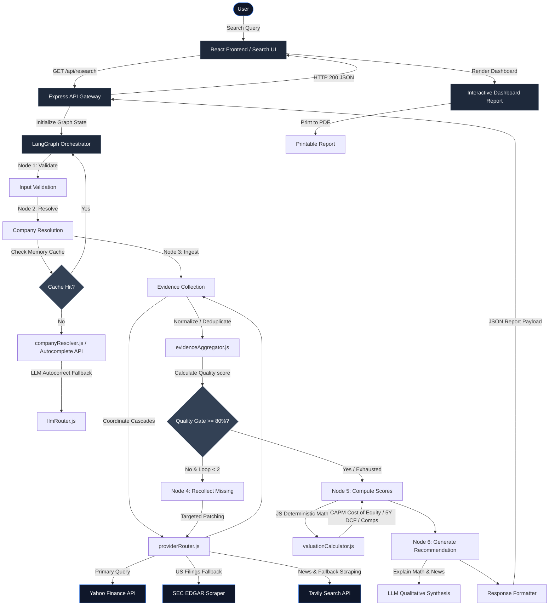

# MarketPilot AI — AI Investment Research Agent

MarketPilot AI is a production-oriented AI Investment Research Agent designed to autonomously research global equities (US, Indian, and Global), compute deterministic health/growth metrics, validate evidence quality, and generate human-in-the-loop explainable investment recommendations ("Buy", "Hold", or "Sell").

---

## Technical Stack
*   **Frontend:** React, Vite, SVG Charts, CSS (Dynamic Light / Dark Mode Toggle)
*   **Backend:** Node.js, Express
*   **AI Orchestration:** LangGraph.js, LangChain.js, Google Gemini, Groq (Llama-3.3-70B)
*   **Financial Data:** Yahoo Finance (`yahoo-finance2`), SEC EDGAR
*   **News:** Tavily Search API
*   **Caching:** In-memory Singleton Cache
*   **Validation:** Similarity Gate, Levenshtein Distance
*   **Documentation:** Mermaid diagrams

---

## Core Engineering Principles
1.  **Deterministic Decision Core:** Financial ratios, safety margins, historical growth rates, scoring card matrices, and execution fallbacks are programmatically calculated in Javascript code. The LLM does not calculate numbers, guess values, or invent scores.
2.  **Explainability & Citation Trace:** Every single data point collected retains a provenance trail—storing the provider name, extraction level, timestamps, and reference source URL—which is exposed directly to the frontend for human audit.
3.  **Graceful Degradation:** Rather than failing on single API dropouts, the system utilizes a multi-tiered provider routing hierarchy (Primary API → Secondary API → Web Search Scrape → LLM Parsing) to gather partial profiles and warn the user instead of throwing exceptions.
4.  **Evidence Validation Gate:** An inspection node evaluates evidence quality before passing variables to the synthesis engine. If data is incomplete, it triggers targeted recollect-actions rather than starting from scratch.

---

## Planned Development Phases

| Phase | Title | Focus Areas | Status |
| :--- | :--- | :--- | :--- |
| **Phase 1** | **Foundation Layer** | Env validation, graph state schema, provider contracts, and interface files. | **Complete** |
| **Phase 2** | **Data & Provider Layer** | Caching, concrete Yahoo/Tavily integrations, and fallback router logic. | **Complete** |
| **Phase 3** | **LangGraph Orchestration**| Building execution nodes, quality evaluation logic, and Graph state machine. | **Complete** |
| **Phase 4** | **Deterministic Valuations**| JavaScript valuation calculator, CAPM Cost of Equity, levered Beta, and DCF. | **Complete** |
| **Phase 5** | **LLM Synthesis & REST API**| Express JSON endpoint router, autocomplete resolves, and prompt constraints. | **Complete** |
| **Phase 6** | **React Frontend Dashboard** | Interactive interface, progress trackers, scores visuals, and citation cards. | **Complete** |
| **Phase 7** | **Testing, Polish & Verification** | End-to-end integration tests, edge-case resolution, and system audit checks. | **Complete** |
| **Phase 8** | **Institutional UI/UX Refinements**| Transforming layout with snapshot, key ratios, tables, checklist, and summaries. | **Complete** |

---

## Development Progress (Current Status: Complete)
We have successfully completed all engineering phases:
*   [x] **Institutional UI/UX Refinement & Transparency (Phase 8):** Overhauled the dashboard executive summary layout with structured company snapshot metadata, key financial ratios tables, score breakdowns, confidence checklists, target pricing gap absolute differentials, news sentiment distributions, and dynamic decision drivers.
*   [x] **Testing, Polish & Verification (Phase 7):** Verified E2E engine outputs against real stock tickers (e.g. `TCS.NS`, `MRF.NS`, `LCID`, `PWL.NS`), confirmed WACC/CAPM/DCF math consistency, validated custom risk warning overrides, and resolved state-sync completeness warnings.
*   [x] **Foundation Layer (Phase 1):** Completed environment validation, graph state annotations, and provider interface abstractions.
*   [x] **Cache Layer (Module 1):** Implemented an in-memory TTL caching engine ([memoryCache.js](file:///c:/Users/Asus/Desktop/MarketPilotAI/server/src/providers/cache/memoryCache.js)) with automated key pruning.
*   [x] **Company Resolution Provider (Module 2):** Developed [companyResolver.js](file:///c:/Users/Asus/Desktop/MarketPilotAI/server/src/providers/implementations/companyResolver.js) supporting deterministic lookup and verified LLM autocorrection.
*   [x] **Financial Provider (Module 3):** Implemented [yahooFinance.js](file:///c:/Users/Asus/Desktop/MarketPilotAI/server/src/providers/implementations/yahooFinance.js) using `yahoo-finance2` and added `fundamentalsTimeSeries` support.
*   [x] **News & Search Providers (Modules 4-5):** Developed [tavilySearch.js](file:///c:/Users/Asus/Desktop/MarketPilotAI/server/src/providers/implementations/tavilySearch.js) wrapping the Tavily Search API.
*   [x] **Evidence Provider Router (Module 6):** Developed [providerRouter.js](file:///c:/Users/Asus/Desktop/MarketPilotAI/server/src/providers/providerRouter.js) to manage field-level fallback recovery.
*   [x] **Valuation Engine (Phase 4):** Centralized valuationConfig.js configurations and built valuationCalculator.js calculating levered beta, CAPM cost of equity, smoothed revenue growths, and DCF cash flow schedules.
*   [x] **REST API Server (Phase 5):** Exposed Express routes (`/api/resolve` and `/api/research`) running LangGraph invocation loops, rate limit buffers, and rate-limit interceptors.
*   [x] **React Frontend Dashboard (Phase 6):** Built a premium monochrome dashboard utilizing Vercel-inspired dark theme styles, autocomplete resolve dropdowns, custom terminal loading streams, circular SVG scorecard dials, and 5-Year Cash Flow projection tables.
*   [x] **Corporate SSL Proxy Bypass & Fallbacks:** Injected NODE_TLS_REJECT_UNAUTHORIZED bypass and price recovery fallbacks to handle Sophos firewalls and newly listed stocks keylessly.
*   [x] **Testing Infrastructure:** Created isolated scripts inside `server/tests/` to verify concrete providers, router loops, and API responses.

---

## Testing Strategy

To guarantee the reliability of individual data retrievers prior to graph orchestration, we maintain an isolated testing suite. These scripts run keylessly for Yahoo and check `.env` API keys for Tavily/LLM:

*   **Run Yahoo Provider Test:**
    ```bash
    node tests/testYahooProvider.js [TICKER]
    ```
*   **Run Company Resolver Test:**
    ```bash
    node tests/testCompanyResolver.js [COMPANY_NAME]
    ```
*   **Run Tavily Search/News Test:**
    ```bash
    node tests/testTavilyProvider.js [COMPANY_NAME]
    ```
*   **Run Master Provider Router Test:**
    ```bash
    node tests/testProviderRouter.js [COMPANY_NAME]
    ```

---

## High-Level System Architecture Diagram



---

## Key Decisions & Trade-offs

### Decoupled Resilient LLM Routing
Rather than hardcoding a single API key or coupling the graph to a single LLM sdk endpoint, we created a specialized LLM Service Router ([llmRouter.js](file:///c:/Users/Asus/Desktop/MarketPilotAI/server/src/providers/llmRouter.js)) wrapping our calls.
*   **Provider Pooling:** Distributes queries between Groq (Llama-3.3-70b-versatile) and Gemini (Gemini-1.5-flash).
*   **Per-Request Key Rotation:** Shuffles a cloned array of Groq keys (`GROQ_API_KEY_1`, `GROQ_API_KEY_2`, etc.) on *every incoming request* to guarantee balanced load distribution.
*   **Smart Retry Strategy:** Evaluates errors and retries *only* retryable exceptions (HTTP 429 rate limits, HTTP 503 drops, connection drops, and network timeouts). For authentication errors (HTTP 401/403) or malformed payload errors (HTTP 400), it fails immediately to prevent unnecessary API overhead.
*   **Provider Failover & Graceful Degradation:** Falls back to Gemini if all Groq pool keys are exhausted. If Gemini fails too, it wraps exceptions in a standard structured JSON error, preventing server crashes.
*   **Provider Metadata Audit:** Returns execution logs (provider name, model, request latency, key identifier, success flag) wrapped alongside payload content (`text` or `data`), supporting state traces.
*   **Separation of Concerns:** LangGraph nodes remain completely generic, communicating only through the abstract `generateJSON()` call.

### Field-Level Recovery vs. Provider Failover
Rather than dropping an entire dataset and triggering a full fallback fetch when a single metric is missing, our router utilizes **Field-Level Recovery**.
*   **Targeted Resolution:** The router evaluates which specific metrics (e.g. `operatingIncome`) are missing or null.
*   **Patching Cascade:** It targets *only* the missing keys by checking:
    $$\text{Primary (QuoteSummary)} \longrightarrow \text{Secondary (fundamentalsTimeSeries)} \longrightarrow \text{Tertiary (SEC EDGAR)} \longrightarrow \text{Search (Tavily Scrape)} \longrightarrow \text{LLM Extraction}$$
*   **Integrity:** Preserves the core numbers provided by high-SLA primary sources, avoiding discrepancies caused by merging full sheets from conflicting APIs.

### Category-Wise Quality Gate Validation
We discard generic boolean checks for a multi-category scorecard logic.
*   **Diagnostic Nodes:** The gate evaluates **Profile, Income Statement, Balance Sheet, Cash Flow, and News** independently.
*   **Recollection Loops:** If any category drops below its configured completeness threshold (e.g. 80%), only the missing fields in that category are routed to fallback collection.
*   **Immutability:** Previously verified data is locked in state to prevent infinite loops and limit API token usage.

### In-Flight Promise Caching (Cache Stampede Protection)
When collecting profile and financials in parallel, they trigger concurrently. To prevent duplicate HTTP requests to Yahoo Finance QuoteSummary, the provider layer caches the active **Promise** in a registry. The concurrent call awaits and reuses the same request promise.

### Evidence Aggregator Layer
An intermediate layer that normalizes multi-provider shapes, removes duplicates, consolidates metadata into `providerCoverage`, and calculates a **deterministic confidence score** entirely in JavaScript before passing it to the reasoning node.

### Deterministic Confidence Scoring
Calculated in JavaScript (not the LLM) based on evidence completeness, fallback levels triggered, missing critical variables, and provider weights.
