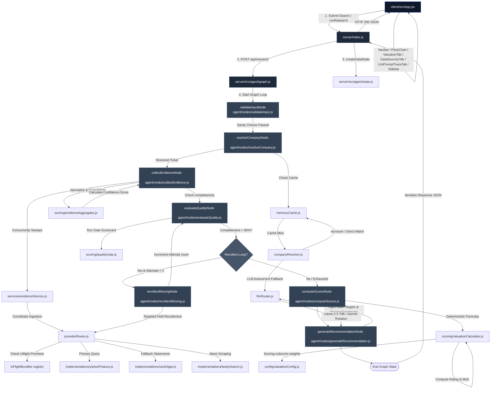

# Project Architecture & Phase Documentation

This document outlines the detailed system engineering architecture, directory structures, execution flows, state schemas, and file responsibilities of **MarketPilot AI**.

---

## 1. System Directory Structure Blueprint

```text
MarketPilotAI/
├── docs/                      # Technical specification phases and documentations
│   ├── phase.md               # [THIS FILE] System engineering specifications
│   └── walkthrough.md         # Implementation verification log
├── client/                    # React (Vite) frontend application source code
│   ├── src/
│   │   ├── main.jsx           # App render mount point
│   │   ├── App.jsx            # State coordinator component
│   │   ├── index.css          # Styling tokens, print directives, and light mode classes
│   │   ├── components/        # Modular dashboard display panels
│   │   │   ├── Navbar.jsx     # Navigation, logo branding, and theme toggler
│   │   │   ├── PriceChart.jsx # Interactive price graph with period filtering (1W/1M/1Y)
│   │   │   ├── ValuationTab.jsx # Valuation Targets and scorecard metrics tables
│   │   │   ├── DataSourcesTab.jsx # Profile metrics and provider logs
│   │   │   ├── LlmPromptTraceTab.jsx # Investment thesis and prompt cascade traces
│   │   │   ├── Sidebar.jsx    # Latencies, recommendation checklist, and print triggers
│   │   │   └── Loader.jsx     # Rotating SVG console log loader
│   │   └── utils/
│   │       └── formatters.js  # Floating number, scale counts, and currency helpers
│   └── vite.config.js         # Port mapping configurations
└── server/                    # Node.js backend workspace
    ├── index.js               # Express REST API routing entry point
    ├── src/
    │   ├── agent/             # LangGraph state machine orchestrator core
    │   │   ├── graph.js       # StateGraph node linkages and routing edges
    │   │   ├── state.js       # AgentState properties and channel schema
    │   │   └── nodes/         # Single-responsibility graph execution nodes
    │   │       ├── validateInput.js         # Input validation constraints Node
    │   │       ├── resolveCompany.js        # Autocomplete & lookup Node
    │   │       ├── collectEvidence.js       # Concurrent API queries Node
    │   │       ├── evaluateQuality.js       # Validation gate scorecard Node
    │   │       ├── recollectMissing.js      # Targeted fallbacks recall Node
    │   │       ├── computeScores.js         # Deterministic calculations Node
    │   │       └── generateRecommendation.js# Qualitative LLM synthesis Node
    │   ├── config/            # Environment and financial policy setups
    │   │   ├── env.js         # API keys validations and defaults
    │   │   ├── valuationConfig.js  # Valuation horizons, CAPM Rf/MRP and sector PE targets
    │   │   └── errorHandler.js # Centralized route error and rate-limit handler
    │   ├── providers/         # Concrete API integration connectors
    │   │   ├── cache/         # Memory caching layer with TTL pruning
    │   │   │   └── memoryCache.js # In-memory TTL key pruner singleton
    │   │   ├── interfaces/    # Structured provider abstract base contracts
    │   │   └── implementations/ # Yahoo, Tavily, and CompanyResolver handlers
    │   │       ├── companyResolver.js       # Autocomplete query logic
    │   │       ├── yahooFinance.js          # QuoteSummary & TimeSeries scraper
    │   │       ├── secEdgar.js              # SEC XBRL facts scraper (US stocks)
    │   │       ├── stooq.js                 # Yahoo Chart price history downloader
    │   │       └── tavilySearch.js          # Tavily search & news connector
    │   │   ├── llmRouter.js         # Rotated key pool Groq/Gemini router
    │   │   └── providerRouter.js    # Ingestion coordinator & recovery cascade
    │   ├── scoring/           # Calculations and diagnostic scorers
    │   │   ├── evidenceAggregator.js # Normalization and confidence scoring
    │   │   ├── qualityGate.js  # Diagnostic quality gates scorecards
    │   │   └── valuationCalculator.js # DCF, multiples comps, and levered Beta math
    │   └── services/          # Abstracted providers orchestration service layer
    │       └── evidenceService.js   # Decoupled business logic API
    └── tests/                 # Isolated testing suites
```

---

## 2. Engineering Architecture Flowchart

This diagram illustrates the concrete runtime sequence, file scopes, data routes, and loop configurations:



---

## 3. File Responsibilities

### Express Gateway & Main Orchestrator
*   [`server/index.js`](file:///c:/Users/Asus/Desktop/MarketPilotAI/server/index.js)
    *   **Purpose:** Backend Express REST API router entrypoint.
    *   **Responsibilities:**
        *   Exposes endpoints `/api/resolve` and `/api/research`.
        *   Manages middleware configurations (CORS, body parser, static paths).
        *   Initializes Graph state and handles E2E pipeline execution response payloads.
*   [`server/src/agent/graph.js`](file:///c:/Users/Asus/Desktop/MarketPilotAI/server/src/agent/graph.js)
    *   **Purpose:** Configures and compiles the LangGraph StateGraph instance.
    *   **Responsibilities:**
        *   Registers all orchestrator nodes (`validateInputNode`, `resolveCompanyNode`, etc.).
        *   Defines linear execution links and conditional routing edges.
        *   Compiles the graph engine with state memory channels.

### LangGraph Lifecycle Nodes
*   [`server/src/agent/state.js`](file:///c:/Users/Asus/Desktop/MarketPilotAI/server/src/agent/state.js)
    *   **Purpose:** Establishes the centralized state schema for graph nodes.
    *   **Responsibilities:**
        *   Defines `AgentStateAnnotation` channels.
        *   Implements array-merging reducers for warnings, news, and history.
        *   Houses initial state generator helper `createInitialState`.
*   [`server/src/agent/nodes/validateInput.js`](file:///c:/Users/Asus/Desktop/MarketPilotAI/server/src/agent/nodes/validateInput.js)
    *   **Purpose:** Validates the user's initial search query.
    *   **Responsibilities:**
        *   Asserts query length limits and blocks SQL/Script injections.
        *   Sets default execution flags and pushes validation warnings to state.
*   [`server/src/agent/nodes/resolveCompany.js`](file:///c:/Users/Asus/Desktop/MarketPilotAI/server/src/agent/nodes/resolveCompany.js)
    *   **Purpose:** Resolves company query to a canonical ticker symbol.
    *   **Responsibilities:**
        *   Coordinates in-memory cache checks and invokes the symbol resolver.
        *   Filters resolution matches through Levenshtein and acronym similarity gates.
*   [`server/src/agent/nodes/collectEvidence.js`](file:///c:/Users/Asus/Desktop/MarketPilotAI/server/src/agent/nodes/collectEvidence.js)
    *   **Purpose:** Concurrently sweeps structured data and news resources.
    *   **Responsibilities:**
        *   Fires parallel requests to Yahoo Finance, Tavily Search, and SEC EDGAR.
        *   Classifies scraped news sentiment and materiality metrics using the LLM.
        *   Invokes the evidence aggregator to normalize raw provider schemas.
*   [`server/src/agent/nodes/evaluateQuality.js`](file:///c:/Users/Asus/Desktop/MarketPilotAI/server/src/agent/nodes/evaluateQuality.js)
    *   **Purpose:** Runs quality checks on the collected database state.
    *   **Responsibilities:**
        *   Invokes the quality gate scorecard to grade profile and filings variables.
        *   Decides if the pipeline needs targeted recollection loops.
*   [`server/src/agent/nodes/recollectMissing.js`](file:///c:/Users/Asus/Desktop/MarketPilotAI/server/src/agent/nodes/recollectMissing.js)
    *   **Purpose:** Coordinates target recovery cascades for missing fields.
    *   **Responsibilities:**
        *   Checks the missing fields list and hits fallback provider routers.
        *   Appends recovery provenance records and increments the execution loop counter.
*   [`server/src/agent/nodes/computeScores.js`](file:///c:/Users/Asus/Desktop/MarketPilotAI/server/src/agent/nodes/computeScores.js)
    *   **Purpose:** Computes fundamental subscores and solves the valuation engines.
    *   **Responsibilities:**
        *   Solves solvency, profitability, and momentum subscore indices.
        *   Invokes the JavaScript `valuationCalculator` to resolve intrinsic prices.
        *   Integrates dynamic safety overrides and maps final scores to Buy/Hold/Sell ratings.
*   [`server/src/agent/nodes/generateRecommendation.js`](file:///c:/Users/Asus/Desktop/MarketPilotAI/server/src/agent/nodes/generateRecommendation.js)
    *   **Purpose:** Generates explainable text summaries explaining calculations.
    *   **Responsibilities:**
        *   Formulates LLM qualitative synthesis prompts under strict math constraints.
        *   Guarantees prompt consistency, forcing ratings and target prices to match JS outputs.

### Provider Integration & Routing Layer
*   [`server/src/providers/cache/memoryCache.js`](file:///c:/Users/Asus/Desktop/MarketPilotAI/server/src/providers/cache/memoryCache.js)
    *   **Purpose:** Provides a process-wide singleton RAM caching layer.
    *   **Responsibilities:**
        *   Maintains key-value records with automated TTL expiry checks.
        *   Runs background GC sweeps every 5 minutes to prevent RAM bloat.
*   [`server/src/providers/implementations/companyResolver.js`](file:///c:/Users/Asus/Desktop/MarketPilotAI/server/src/providers/implementations/companyResolver.js)
    *   **Purpose:** Executes fuzzy search lookups to identify verified tickers.
    *   **Responsibilities:**
        *   Queries autocomplete endpoints and falls back to LLM suggestions under rate limits.
*   [`server/src/providers/implementations/yahooFinance.js`](file:///c:/Users/Asus/Desktop/MarketPilotAI/server/src/providers/implementations/yahooFinance.js)
    *   **Purpose:** Scrapes core financial modules and time-series reports.
    *   **Responsibilities:**
        *   Retrieves QuoteSummary modules (price, detail, cash flow, statements).
        *   Falls back to `fundamentalsTimeSeries` arrays for historical figures.
*   [`server/src/providers/implementations/secEdgar.js`](file:///c:/Users/Asus/Desktop/MarketPilotAI/server/src/providers/implementations/secEdgar.js)
    *   **Purpose:** Extracts XBRL financial facts for US equities.
    *   **Responsibilities:**
        *   Retrieves SEC CIK mapping and downloads balance sheet / cash flow filings.
*   [`server/src/providers/implementations/stooq.js`](file:///c:/Users/Asus/Desktop/MarketPilotAI/server/src/providers/implementations/stooq.js)
    *   **Purpose:** Downloader for historical daily price quotes.
    *   **Responsibilities:**
        *   Retrieves the last 1 year of daily closes from Yahoo Finance Chart API.
*   [`server/src/providers/implementations/tavilySearch.js`](file:///c:/Users/Asus/Desktop/MarketPilotAI/server/src/providers/implementations/tavilySearch.js)
    *   **Purpose:** Connector wrapping the Tavily Search API.
    *   **Responsibilities:**
        *   Queries recent news articles, dates, and URL citations.
        *   Scrapes unstructured text fallback profiles under missing-field conditions.
*   [`server/src/providers/providerRouter.js`](file:///c:/Users/Asus/Desktop/MarketPilotAI/server/src/providers/providerRouter.js)
    *   **Purpose:** Ingestion coordinator managing field-level recovery cascades.
    *   **Responsibilities:**
        *   Implements cache stampede de-duplication via `inFlightBundles` registry.
        *   Cascades lookups down provider hierarchy to patch missing metrics.
*   [`server/src/providers/llmRouter.js`](file:///c:/Users/Asus/Desktop/MarketPilotAI/server/src/providers/llmRouter.js)
    *   **Purpose:** Manages rotated key API pools for Groq and Gemini.
    *   **Responsibilities:**
        *   Balances requests across active keys and fails over to Gemini.
        *   Retries only network timeouts and rate limit errors (HTTP 429).
*   [`server/src/services/evidenceService.js`](file:///c:/Users/Asus/Desktop/MarketPilotAI/server/src/services/evidenceService.js)
    *   **Purpose:** Decouples graph nodes from raw provider configurations.
    *   **Responsibilities:**
        *   Exposes clean getProfile/getFinancials API wrappers.

### Scoring & Mathematical Valuations
*   [`server/src/scoring/evidenceAggregator.js`](file:///c:/Users/Asus/Desktop/MarketPilotAI/server/src/scoring/evidenceAggregator.js)
    *   **Purpose:** Normalizes collected provider outputs.
    *   **Responsibilities:**
        *   Computes the deterministic confidence score.
        *   Generates the confidence explanation checklist.
*   [`server/src/scoring/qualityGate.js`](file:///c:/Users/Asus/Desktop/MarketPilotAI/server/src/scoring/qualityGate.js)
    *   **Purpose:** Evaluates completeness scorecards across categories.
    *   **Responsibilities:**
        *   Grades profile, statement, and news data completeness.
*   [`server/src/scoring/valuationCalculator.js`](file:///c:/Users/Asus/Desktop/MarketPilotAI/server/src/scoring/valuationCalculator.js)
    *   **Purpose:** Core quantitative valuation modeling script.
    *   **Responsibilities:**
        *   Calculates CAPM Cost of Equity WACC and dynamic FCF growth rates.
        *   Solves 5-Year DCF schedules and Terminal Values.
        *   Solves sector relative PE/PB multiple targets.
        *   Blends models into consensus target prices.
*   [`server/src/config/valuationConfig.js`](file:///c:/Users/Asus/Desktop/MarketPilotAI/server/src/config/valuationConfig.js)
    *   **Purpose:** Centralizes macroeconomic assumptions and sector multiple targets.
    *   **Responsibilities:**
        *   Declares cost of equity constants, terminal growths, and model weights.

---

## 4. LangGraph Agent State Documentation

| Channel Field Name | Initialized In | Updated In | Consumed In | Purpose / Description |
| :--- | :--- | :--- | :--- | :--- |
| **`inputCompanyName`** | `state.js` | *Never* | `resolveCompany.js` | Raw user company search query string. |
| **`resolvedTicker`** | `state.js` | `resolveCompany.js` | `collectEvidence.js` <br> `computeScores.js` | Canonical ticker symbol utilized throughout ingestion & calculations. |
| **`resolvedName`** | `state.js` | `resolveCompany.js` | `collectEvidence.js` | Official corporate identity name. |
| **`market`** | `state.js` | `resolveCompany.js` | `collectEvidence.js` | Target exchange/market registry (e.g. US, IN, Global). |
| **`resolutionConfidence`** | `state.js` | `resolveCompany.js` | *UI* | Similarity match percentage of resolved ticker symbol. |
| **`profile`** | `state.js` | `collectEvidence.js` <br> `recollectMissing.js` | `computeScores.js` <br> *UI* | Corporate metadata snapshot (CEO, sector, employees). |
| **`financials`** | `state.js` | `collectEvidence.js` <br> `recollectMissing.js` | `computeScores.js` <br> *UI* | Structured income statement, balance sheet, cash flows. |
| **`news`** | `state.js` | `collectEvidence.js` | `computeScores.js` <br> `generateRecommendation.js` | Scraped news article details and classified sentiments. |
| **`marketContext`** | `state.js` | `collectEvidence.js` | `computeScores.js` <br> *UI* | Historical daily closing stock price quote array. |
| **`providerCoverage`** | `state.js` | `collectEvidence.js` <br> `recollectMissing.js` | `evidenceAggregator.js` <br> *UI* | Provenance metadata log indicating provider sources. |
| **`fallbackHistory`** | `state.js` | `collectEvidence.js` <br> `recollectMissing.js` | *UI* | Audit list of failed attempts and warning codes. |
| **`recoveryHistory`** | `state.js` | `collectEvidence.js` <br> `recollectMissing.js` | `evidenceAggregator.js` <br> *UI* | Provenance records tracking field-level recollection loops. |
| **`warnings`** | `state.js` | `validateInput.js` <br> `collectEvidence.js` | *UI* | Execution warning codes and message objects. |
| **`missingFields`** | `state.js` | `evaluateQuality.js` | `recollectMissing.js` | Set of fields currently flagged as missing or null. |
| **`executionStage`** | `state.js` | *Every Node* | *UI* | Human-friendly pipeline progress tag. |
| **`qualityReport`** | `state.js` | `evaluateQuality.js` | *UI* | Complete completeness scores across categories. |
| **`evidenceCompleteness`** | `state.js` | `evaluateQuality.js` | `graph.js` (Route Edge) | Aggregated quality score driving loop decisions. |
| **`recollectionAttempts`** | `state.js` | `recollectMissing.js` | `graph.js` (Route Edge) | Ingestion loop retry counter (capped at 2). |
| **`scores`** | `state.js` | `computeScores.js` | `generateRecommendation.js` <br> *UI* | Profitability, Solvency, and Momentum scorecard indices. |
| **`valuation`** | `state.js` | `computeScores.js` | `generateRecommendation.js` <br> *UI* | CAPM constants, DCF arrays, comps target valuations. |
| **`recommendation`** | `state.js` | `generateRecommendation.js` | *UI* | Final recommendation rating, thesis, and risks. |

---

## 5. Detailed Implementation Phases

### Phase 1: Foundation Layer (Complete)
Established config validation (`env.js`), graph channels (`state.js`), and abstract provider contracts (`interfaces/`).

### Phase 2: Data & Provider Layer (Complete)
Implemented cache singleton, ticker autocompletes, Tavily search connectors, SEC EDGAR XBRL scrapers, Yahoo Chart historical downloaders, and the master router's field-level recovery cascade.

#### A. In-Memory Cache System (No Database Architecture)
Since there is no external database like Redis or MongoDB, the caching mechanism is implemented entirely in-memory using the Node.js process RAM:
*   **Singleton Memory Store:** The cache module ([memoryCache.js](file:///c:/Users/Asus/Desktop/MarketPilotAI/server/src/providers/cache/memoryCache.js)) exports a single, globally instantiated singleton class that holds a private JavaScript `Map` object: `this.store = new Map();`. Because the Node.js server process runs continuously in the background, the state of this `Map` is preserved across all HTTP API requests.
*   **Time-To-Live (TTL) & Expiries:** When saving a key (e.g. `yahoo-financials:AAPL`), it assigns an expiry timestamp `Date.now() + duration`. During lookup, it compares the current time against the key's expiry. If expired, it deletes the key and returns `null`.
*   **Memory Leak Auto-Pruning:** A background garbage-collection timer runs every 5 minutes using `setInterval` to scan the store, prune expired entries, and release memory automatically.
*   **Cache Clearing Route:** We exposed a POST endpoint `/api/cache/clear` in [index.js](file:///c:/Users/Asus/Desktop/MarketPilotAI/server/index.js) that calls `cache.clear()` to purge all cached objects on-demand, making it easy to reset states during testing.

#### B. Manual Verification Steps for Cache
1.  **Start Server:** Launch the server inside `server/` with `node index.js`.
2.  **Initial Run (Cache Miss):** Query `AAPL` in the React search bar. Look at the server terminal logs to see:
    ```text
    [Yahoo Finance]: Fetching QuoteSummary modules for "AAPL"
    [Cache]: Saved key: yahoo-financials:AAPL (TTL: 3600000ms)
    ```
    *The first load requires active network requests and takes 1–3 seconds.*
3.  **Repeat Run (Cache Hit):** Click "Back to Search" and query `AAPL` again. The data loads instantly (<50ms). Look at the logs:
    ```text
    [Cache]: Hit for key: company-resolution:AAPL
    [Cache]: Hit for key: yahoo-financials:AAPL
    ```
4.  **Clear Cache:** Send a POST request to clear the RAM store:
    *   *PowerShell:* `Invoke-RestMethod -Uri http://localhost:5000/api/cache/clear -Method Post`
    *   *Bash/Curl:* `curl -X POST http://localhost:5000/api/cache/clear`
    The server will log `[Cache]: Cache cleared completely.`
5.  **Verify Reset:** Query `AAPL` a third time. The request will trigger a cache miss and execute fresh API calls.

### Phase 3: LangGraph Orchestration Layer (Complete)
Built the service layer, single-responsibility nodes, input validation, evidence aggregator diagnostics, compiled StateGraph with conditional routing, and verification tests.

### Phase 4: Deterministic Scoring & Valuations (Complete)
We have built a fully transparent, configurable, and mathematically explainable **Consensus Valuation Engine** in JavaScript. The implementation separates core formulas from LLM interpretation, ensuring that numerical accuracy is fully preserved in code while the LLM focuses entirely on qualitative analysis.

#### A. Phase 4 Files & Usages
The following files were created or modified to implement the financial scoring and deterministic valuation pipeline:
1.  **[`server/src/config/valuationConfig.js`](file:///c:/Users/Asus/Desktop/MarketPilotAI/server/src/config/valuationConfig.js)**
    *   **Usage:** Declares baseline macro settings (risk-free rate, market risk premium, forecast years, and terminal perpetual growth) alongside sector multiples tables (prepared for P/E, P/B, EV/EBITDA, P/S) and consensus blending weights.
    *   **Pipeline Position:** Loaded by the valuation library at execution time to set policy rules.
2.  **[`server/src/scoring/valuationCalculator.js`](file:///c:/Users/Asus/Desktop/MarketPilotAI/server/src/scoring/valuationCalculator.js)**
    *   **Usage:** Contains the core mathematical modeling engines:
        *   *CAPM Cost of Equity:* Solves $\beta_L$ using balance sheet leverage, then applies CAPM.
        *   *Smoothed Growth Average:* Averages YoY growths and applies linear compression to eliminate spikes.
        *   *5-Year DCF:* Projects FCF, discounts using Cost of Equity ($K_e$), and solves intrinsic fair price keylessly.
        *   *Relative Multiples:* Multiplies earnings and book equity by sector benchmarks.
        *   *Consensus Blender:* Averages DCF (60%) and Comps (40%).
    *   **Pipeline Position:** Invoked by `computeScoresNode` to perform quantitative valuation.
3.  **[`server/src/agent/state.js`](file:///c:/Users/Asus/Desktop/MarketPilotAI/server/src/agent/state.js)**
    *   **Usage:** Added the rich `valuation` state channel and schema to store raw consensus prices, upside margins of safety, assumptions, and intermediate calculation arrays.
    *   **Pipeline Position:** Defines the shared data schema passed between LangGraph nodes.
4.  **[`server/src/agent/nodes/computeScores.js`](file:///c:/Users/Asus/Desktop/MarketPilotAI/server/src/agent/nodes/computeScores.js)**
    *   **Usage:** Extracts the resolved financial history, invokes `valuationCalculator.compileValuationReport()`, and updates the graph state with the rich valuation payload.
    *   **Pipeline Position:** Executed directly after the targeted recollection nodes check out of quality gates.
5.  **[`server/src/agent/nodes/generateRecommendation.js`](file:///c:/Users/Asus/Desktop/MarketPilotAI/server/src/agent/nodes/generateRecommendation.js)**
    *   **Usage:** Injects the current trading price, consensus target price, and the rich intermediate assumptions into the LLM synthesis prompt template, forcing prompt constraints that restrict the LLM from inventing numerical scores. It also computes a separate deterministic Assignment Decision (`INVEST` / `PASS`) using a multi-factor rule to satisfy the binary requirement. The mapping logic is:
        *   **`BUY` $\rightarrow$ `INVEST`:** Automatically marked as `INVEST`.
        *   **`HOLD` $\rightarrow$ `INVEST` (High-Quality Hold):** Marked as `INVEST` if the stock is a safe, high-quality business (overall score $\ge 50$, financials score $\ge 50$, safety score $\ge 60$, and margin of safety $\ge -15\%$).
        *   **`HOLD` $\rightarrow$ `PASS` (Low-Quality / Bubble Hold):** Marked as `PASS` if the stock fails any of the high-quality holding checks (e.g., overall score $< 50$, weak solvency/profitability, or pricing bubble exceeding a $15\%$ premium).
        *   **`SELL` $\rightarrow$ `PASS`:** Automatically marked as `PASS` due to fundamental distress or extreme overvaluation.
        Exposes the institutional rating as `researchRating` (`BUY`/`HOLD`/`SELL`), leaving core scoring logic unchanged.
    *   **Pipeline Position:** The final node of the StateGraph before compile output.
6.  **[`server/src/scoring/evidenceAggregator.js`](file:///c:/Users/Asus/Desktop/MarketPilotAI/server/src/scoring/evidenceAggregator.js)**
    *   **Usage:** Realigned `calculateConfidence` to query the program's stateless `evaluateQualityGate` report, ensuring that empty balance sheet elements correctly decrease the deterministic confidence percentage (e.g. dropping to 60% for partial filings).
    *   **Pipeline Position:** Invoked inside `collectEvidenceNode` and `recollectMissingNode` to audit data quality.
7.  **[`server/tests/testGraph.js`](file:///c:/Users/Asus/Desktop/MarketPilotAI/server/tests/testGraph.js)**
    *   **Usage:** Added diagnostic sections rendering the base FCF, projected arrays, terminal values, present values, and multiple valuations to verify all mathematical formulas.
    *   **Pipeline Position:** Terminal test CLI runner.

#### B. Why We Estimate Intrinsic Value (Target Price)
*   **What is Intrinsic Value?** Intrinsic value is the "true" or "fair" value of a business based on its underlying cash-generating power, financial health, and risk profile. It is completely independent of the stock market trading price.
*   **Why Professional Investors Estimate Fair Value:**
    1.  *Margin of Safety:* Investors seek a "buffer" between the purchase price and the intrinsic value to protect against forecasting errors or temporary market downturns.
    2.  *Objective Decision-Making:* Having a math-backed target price prevents investors from making emotional decisions driven by daily market volatility or short-term panic/hype.
*   **Why Different Analysts Obtain Different Target Prices:** Valuation is not a hard science; it is a set of logical projections. Different analysts make different assumptions about growth rates, cost of equity discount rates, and long-term perpetual growth rates.
*   **Why Calculate Our Own Valuation vs. Fetching Analyst Targets:**
    1.  *Analyst Optimism Bias:* Sell-side analysts historically skew heavily towards optimistic ratings due to institutional conflicts of interest.
    2.  *Stale Lagging Indicators:* Consensus figures are updated infrequently and lag macroeconomic shifts.
    3.  *Low Coverage on Niche / Mid-Cap Equities:* Many regional equities or mid-caps have zero institutional coverage.
    4.  *Custom Stress-Testing:* By controlling the calculation models in JavaScript, we can dynamically stress-test scenarios.

#### C. Dynamic vs. Configurable Inputs
*   **Dynamic Inputs (Stock-Specific):** Retrieved and computed dynamically for each target company: Revenue, Net Income, Free Cash Flow (FCF), Book Value / Total Equity, Market Capitalization, Current Stock Price, and Total Debt.
*   **Configurable Inputs (Global Policy Settings):** Centralized in `valuationConfig.js`: Risk-Free Rate ($R_f = 4.0\%$), Market Risk Premium ($\text{MRP} = 6.0\%$), Forecast Horizon (5 Years), Terminal Growth Rate (2.5%), and Sector Multiples.

#### D. In-Depth Formula Documentation
*   **Revenue Growth Rate (Smoothed Average):** YoY growth is calculated, and extreme growth spikes are compressed dynamically to prevent abnormal outlier forecasts:
    $$\text{YoY Growth}_t = \left(\frac{\text{Revenue}_t - \text{Revenue}_{t-1}}{\text{Revenue}_{t-1}}\right) \times 100$$
    $$\text{Smoothed YoY Growth}_t = \begin{cases} 
      30 + 0.1 \times (\text{YoY Growth}_t - 30) & \text{if } \text{YoY Growth}_t > 30 \\
      -20 + 0.1 \times (\text{YoY Growth}_t + 20) & \text{if } \text{YoY Growth}_t < -20 \\
      \text{YoY Growth}_t & \text{otherwise}
   \end{cases}$$
*   **Free Cash Flow Growth Rate (Projected):** Projected FCF growth rate is bounded between a configured minimum limit (2.5%) and a dynamic growth cap (12% to 22% depending on historical revenue growth):
    $$\text{Projected } g_{\text{FCF}} = \max\left(\text{MinLimit}, \min\left(\text{MaxLimit}, \text{Consensus Growth}\right)\right)$$
*   **Levered Beta ($\beta_L$) & Cost of Equity ($K_e$) via CAPM:**
    $$\beta_{\text{levered}} = \beta_{\text{unlevered}} \times \left(1 + (1 - \text{Tax Rate}) \times \frac{\text{Total Debt}}{\text{Total Equity}}\right)$$
    $$\text{Cost of Equity } (K_e) = R_f + \beta_{\text{levered}} \times \text{MRP}$$
*   **Perpetual Terminal Value (TV):** Projects Year 6 perpetuity value:
    $$TV = \frac{FCF_5 \times (1 + g_{\text{terminal}})}{K_e - g_{\text{terminal}}}$$
*   **Discounted Cash Flow (PV of Cash Flows):**
    $$PV = \sum_{t=1}^5 \frac{FCF_t}{(1 + K_e)^t} + \frac{TV}{(1 + K_e)^5}$$
*   **Enterprise Value & Equity Value (Algebraic Resolution):** Resolves fair price without shares database lookup to bypass paid API limitations:
    $$\text{Fair Stock Price (DCF)} = \text{Current Stock Price} \times \left(\frac{\text{Total Present Value of Equity (PV)}}{\text{Total Market Cap}}\right)$$
*   **Relative Valuation (Comparable Multiples):**
    $$\text{PE Valuation} = \text{Current Price} \times \left(\frac{\text{Net Income} \times \text{Target PE}}{\text{Market Cap}}\right)$$
    $$\text{PB Valuation} = \text{Current Price} \times \left(\frac{\text{Book Equity} \times \text{Target PB}}{\text{Market Cap}}\right)$$
    $$\text{Relative Multiple Fair Price} = \frac{\text{PE Valuation} + \text{PB Valuation}}{2}$$
*   **Blended Consensus Valuation:**
    $$\text{Consensus Target Price} = 60\% \times \text{DCF Value} + 40\% \times \text{Relative Multiples Value}$$
*   **Margin of Safety (MoS):**
    $$\text{Margin of Safety (\%)} = \left(\frac{\text{Consensus Target Price} - \text{Current Price}}{\text{Consensus Target Price}}\right) \times 100$$

#### E. Valuation Engine Assumptions & Uncertainties
*   *Dynamic Assumptions (Calculated per Stock):* Revenue growth, FCF forecast growth, CAPM WACC Cost of Equity (leveraged dynamically by solvency ratio), and target sector multiples.
*   *Configurable assumptions (Centralized Policies):* Forecast horizon (5 years), perpetual growth (2.5% inflation proxy), CAPM constants ($R_f = 4.0\%$, $\text{MRP} = 6.0\%$), and blended weights.

### Phase 5: LLM Synthesis & REST API (Complete)
Exposed Express endpoints `/api/resolve` and `/api/research`, implemented global errorHandler.js middlewares catcher, and wrote strict prompt constraints ensuring LLM explains decisions without inventing numbers.

### Phase 6: React Frontend Dashboard (Complete)
Built the institutional user interface, monochrome dark/light layout tokens, circular SVG scorecard dials, 5-Year Cash Flow projection tables, dynamic loading logs console stream loader, and SSL proxy bypass routines.

### Phase 7: Testing, Polish & Verification (Complete)
Verified E2E calculations against real tickers, confirmed key API rotation logic, handled completeness gate alerts, and implemented dynamic currency symbol resolution (e.g. `INR` / `₹`, `GBP` / `£`, `EUR` / `€`, defaulting to `USD` / `$`).

### Phase 8: Institutional UI/UX Refinement & Transparency
Refactored the dashboard executive summary layout with structured company snapshot metadata, key financial ratios tables, score breakdowns, confidence checklists, target pricing gap absolute differentials, news sentiment distributions, and dynamic decision drivers.

---

## 6. Technology Stack
*   **Frontend:** React, Vite, SVG Charts, CSS (Dynamic Light / Dark Mode Toggle)
*   **Backend:** Node.js, Express
*   **AI Orchestration:** LangGraph.js, LangChain.js, Google Gemini, Groq (Llama-3.3-70B)
*   **Financial Data:** Yahoo Finance (`yahoo-finance2`), SEC EDGAR
*   **News:** Tavily Search API
*   **Caching:** In-memory Singleton Cache
*   **Validation:** Similarity Gate, Levenshtein Distance
*   **Documentation:** Mermaid diagrams
