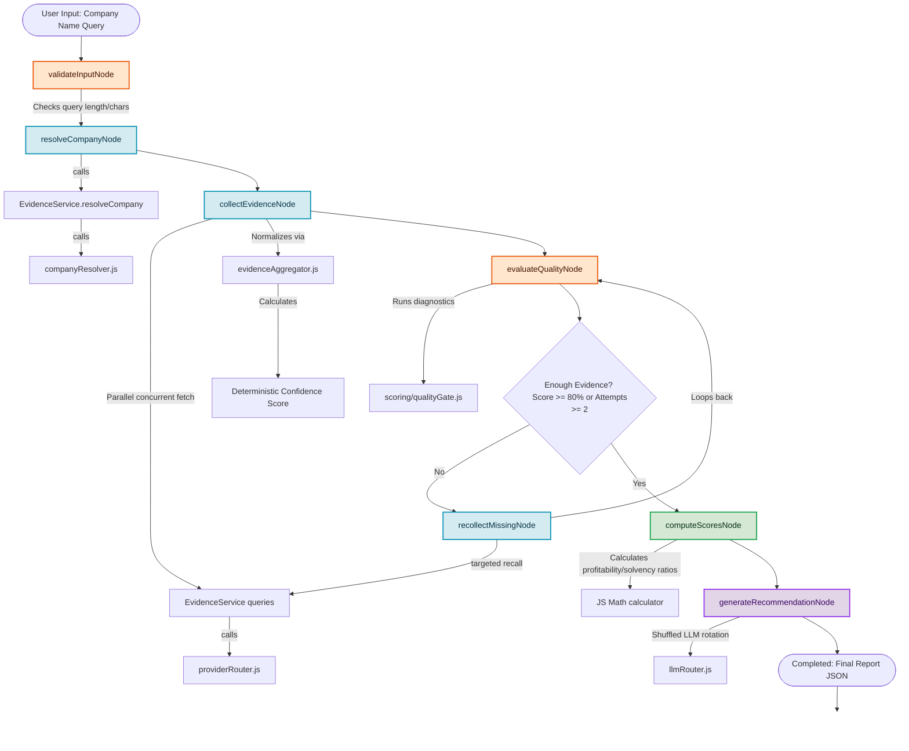

# Project Architecture & Phase Documentation

This document outlines the design architecture, directory structure, data cascades, and implementation phases of **MarketPilot AI**.

---

## 1. Directory Structure Blueprint

```
MarketPilotAI/
├── docs/
│   ├── phase.md                     # [THIS FILE] System phases detail doc
│   └── architecture_workflow.png     # Rendered visual node execution flowchart
├── server/
│   ├── src/
│   │   ├── agent/
│   │   │   ├── nodes/
│   │   │   │   ├── validateInput.js         # Input validation constraints Node
│   │   │   │   ├── resolveCompany.js        # Autocomplete & lookup Node
│   │   │   │   ├── collectEvidence.js       # Concurrent API queries Node
│   │   │   │   ├── evaluateQuality.js       # Validation gate scorecard Node
│   │   │   │   ├── recollectMissing.js      # Targeted fallbacks recall Node
│   │   │   │   ├── computeScores.js         # Deterministic calculations Node
│   │   │   │   └── generateRecommendation.js# Qualitative LLM synthesis Node
│   │   │   ├── graph.js             # StateGraph setup and compilation
│   │   │   └── state.js             # State schema annotations and reducers
│   │   ├── config/
│   │   │   └── env.js               # Centralized credential loading
│   │   ├── providers/
│   │   │   ├── cache/
│   │   │   │   └── memoryCache.js   # In-memory TTL key pruner singleton
│   │   │   ├── implementations/
│   │   │   │   ├── companyResolver.js       # Autocomplete query logic
│   │   │   │   ├── yahooFinance.js          # QuoteSummary & TimeSeries scraper
│   │   │   │   ├── secEdgar.js              # SEC XBRL facts scraper (US stocks)
│   │   │   │   ├── stooq.js                 # Yahoo Chart price history downloader
│   │   │   │   └── tavilySearch.js          # Tavily search & news connector
│   │   │   ├── interfaces/
│   │   │   │   ├── financialProvider.js     # Abstract financial provider schema
│   │   │   │   ├── newsProvider.js          # Abstract news article schema
│   │   │   │   ├── searchProvider.js        # Abstract web search result schema
│   │   │   │   └── llmProvider.js           # Abstract LLM execution schema
│   │   │   ├── llmRouter.js         # Rotated key pool Groq/Gemini router
│   │   │   └── providerRouter.js    # Ingestion coordinator & recovery cascade
│   │   ├── scoring/
│   │   │   ├── evidenceAggregator.js# CONSISTENCY & CONFIDENCE AGGREGATOR
│   │   │   └── qualityGate.js       # Quality evaluation diagnostics calculator
│   │   └── services/
│   │       └── evidenceService.js   # Decoupled business logic API
│   └── tests/
│       ├── testCompanyResolver.js   # Autocomplete isolated test
│       ├── testYahooProvider.js     # Yahoo QuoteSummary raw test
│       ├── testTavilyProvider.js    # Tavily Search/News keys test
│       ├── testFinancialProvider.js # TimeSeries vs SEC vs Stooq test
│       ├── testProviderRouter.js    # Recovery cascade trace test
│       └── testGraph.js             # E2E StateGraph integration test
```

---

## 2. Core Architectural Principles

### A. In-Flight Request De-duplication (Cache Stampede Protection)
When retrieving `profile` and `financials` concurrently inside `collectEvidenceNode`, they execute in parallel. To prevent concurrent cache misses from firing duplicate HTTP requests to Yahoo Finance, the provider layer caches the active **Promise** inside an `inFlightBundles` registry. The second concurrent query reuses the same request promise.

### B. Intermediate Evidence Aggregator Layer
Sits between the evidence collection nodes and the Quality Gate. It normalizes different provider data shapes, removes duplicates, merges sources metadata into `providerCoverage`, counts recovered fields, and calculates a **deterministic confidence score** programmatically in JavaScript.

### C. Deterministic Confidence Score
Rather than allowing the LLM to hallucinate a confidence percentage, a JavaScript formula computes it dynamically:
*   **Base Score:** 100%
*   **Penalties:**
    *   Missing profile elements: `-5%`
    *   Missing financial sheets: `-15%`
    *   `YahooTimeSeries` fallback used: `-5%`
    *   `SecEdgar` fallback used: `-10%`
    *   `TavilySearch+LLM` fallback used: `-20%`
    *   Low news articles: `-5%` (1-2 articles), `-10%` (0 articles)
*   **Bound:** Minimum 30%, Maximum 100%

### D. Disabled Target Prices
To prevent LLM hallucination, `targetPrice` is set to `null` and marked as "Not Estimated" until a deterministic valuation algorithm (DCF/relative multiples) is coded in JavaScript (Phase 4).

---

## 3. Detailed Workflow Execution Diagram



---

## 4. Development Implementation Phases

### Phase 1: Foundation Layer (Complete)
Established config validation (`env.js`), graph channels (`state.js`), and abstract provider contracts (`interfaces/`).

### Phase 2: Data & Provider Layer (Complete)
Implemented cache singleton, ticker autocompletes, Tavily search connectors, SEC EDGAR XBRL scrapers, Yahoo Chart historical downloaders, and the master router's field-level recovery cascade.

### Phase 3: LangGraph Orchestration Layer (Complete)
Built the service layer, single-responsibility nodes, input validation, evidence aggregator diagnostics, compiled StateGraph with conditional routing, and verification tests.

### Phase 4: Deterministic Scoring (Upcoming)
Develop mathematical scorecard calculations:
*   DCF Valuation model (Free cash flow forecasting, discount rate, terminal growth).
*   Relative Valuation Multiples (P/E, P/B, EV/EBITDA compared to sector).
*   Risk scorecard grading.

### Phase 5: LLM Synthesis & API (Upcoming)
Expose the orchestration graph via Express REST endpoints, integrate error handlers, and refine reasoning synthesis prompts.

### Phase 6: React Frontend Dashboard (Upcoming)
Create an interactive dashboard showcasing score visuals, citation overlays, recovery logs, and pdf exports.
